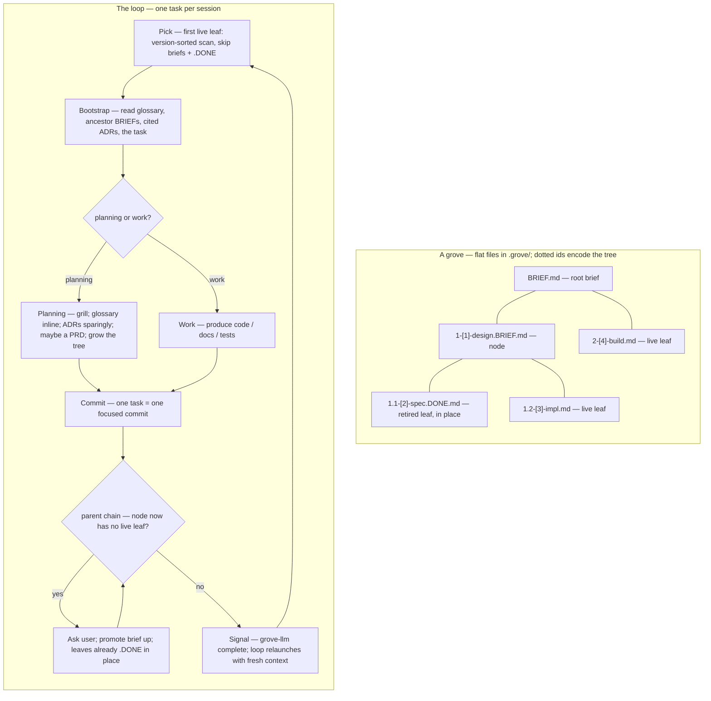

# grove — hierarchical, self-extending workstreams

A **grove** is one workstream driven as a git-tracked **tree of task files**,
one task per session. Planning tasks grow the tree as understanding deepens;
completed branches retire to an archive. The tree's shape — what `ls` shows —
is the only state; git is the history.

## The spine — seven constraints

grove drives long work *without* becoming brittle, constraining machinery.
These seven rules are non-negotiable; everything below is subordinate to them.

1. **Artifacts, not state.** No phase file, no session log, no status file.
   What `ls` shows is the only state; git is the history.
2. **Read, don't run.** A session bootstraps by *reading markdown* — no script
   must succeed before work begins. (Materialising or updating grove itself is
   a separate maintenance action and may use a script — see `VERSION.md`.)
3. **Suggested shape, not enforced schema.** Task files and briefs are freeform
   markdown. The format files are guides; nothing validates them.
4. **Lazy and optional.** Every artifact — brief, ADR, PRD, glossary entry — is
   created only when it earns its place, never because a step demands it.
5. **grove guides, it does not gate.** grove never refuses to proceed. A task
   may be done by hand, reordered, or skipped.
6. **Walk-away-able.** Delete this skill and `.grove/` is still a legible
   folder of notes; every durable output is standard, team-readable markdown.
7. **One page of rules.** If the loop below does not fit on a page, it is too
   complex — cut until it does.

## The loop

One task is one session. All sessions of one grove run in the **same git worktree** at `<repo>/.grove-worktrees/<name>/` on branch `<name>` — new worktrees are for separating *concurrent groves*, not for separating tasks within a grove. The grove's task tree lives at `.grove/` inside that worktree.

Sessions are launched by the `grove` CLI (installed via `brew install Linkuistics/taps/grove`): `grove do <name>` is the **sole lifecycle entry verb** — for a brand-new grove it creates the worktree, branches off the default branch, and opens a bootstrap session; for an existing grove it resumes (re-attaching the worktree first if the branch is present but the worktree is gone). It pre-names the harness session, so the rename ritual is unnecessary in the common case. If the grove's `.grove/` is still in the legacy `NNN-slug/` directory format, the first `grove do` **migrates it to the current dotted-decimal scheme** — one reviewable, committed change — before driving; the migration is idempotent once a tree is new-format, and there is **no** transitional dual-format reader (ADR-0034).

`grove do <name>` drives the **whole loop**, not one task (ADR-0032). It is a thin, stateless **self-driving loop**: launch one fresh foreground `claude` (owning the real TTY, so grilling / resize / Ctrl-C are all native), and when that session ends, **relaunch with fresh context** — but only if the agent fired the completion signal. That makes each task a clean-context session without a manual `/clear`+relaunch crank. **Relaunch is opt-in:** any other exit — your `/exit`, the human's Ctrl-C, or a crash — **stops** the loop, resumable later by re-running `grove do <name>`. Because the loop body holds zero engine state and re-derives its position from `grove-llm pick` every iteration, **restart ≡ continuation** by construction; a crashed mid-task leaf (commit-before-retire, then signal) is simply re-picked and redone. There is no PTY wrapper and no daemon — a plain shell `while` loop could stand in (constraint 6).

If a session was started without the helpers and the session name doesn't already match `<repo>: <name> grove`, suggest `/rename <repo-basename>: <name> grove` once per session and move on. The skill already knows both names: `<name>` from the worktree's branch (`git rev-parse --abbrev-ref HEAD`), `<repo-basename>` from `git rev-parse --show-toplevel`'s parent (the worktree's path is `<repo>/.grove-worktrees/<name>/`).

**Starting a new grove.** `grove do <name>` on a brand-new grove creates the
worktree and branch but no `.grove/` tree yet — and every step below assumes
`.grove/` already exists. Resolve that chicken-and-egg first: a rootless grove
has nothing for `grove-llm pick` to walk (it errors `grove root not found`), and
the tree-growing verbs (`leaf-add` and friends) all need a root too. Run
**`grove-llm root-init [<slug>]`** (default slug `plan`) once: it creates
`.grove/`, the root `BRIEF.md` stub, and a first **planning** leaf
`1-[1]-<slug>.md` — working-tree only, no commit (the first session's commit folds
it in), refusing to clobber an existing `.grove/`. Creating the first leaf, not
just the brief, is load-bearing: `pick` skips every brief (`.BRIEF`), so a brief-only
`.grove/` reports `no live leaves; this grove is done` and would mis-trigger the
Complete finish cycle — a newborn grove indistinguishable from a finished one
(ADR-0011). After `root-init`, `pick` returns the planning leaf and you enter the
normal loop below at **Bootstrap**; the launcher's `start.md` prompt names this
as step one.

**Pick.** Run `grove-llm pick` — it scans the flat `.grove/` list once in
dotted-decimal **position** order (a version sort), skipping briefs (`.BRIEF`)
and retired (`.DONE`) leaves, and prints the absolute path of the next live
`.md` leaf. Empty stdout (and a diagnostic on stderr) means the grove has no
live leaves and is ready to **Finish**. The walk's *semantics* (position-sorted —
which *is* depth-first pre-order, since a node's id is a prefix of its children's;
skip every `.BRIEF` and `.DONE`; a brief is not a leaf) are what the verb
implements; reach for them only when reasoning about the walk, not when running
it.

**Bootstrap.** Read, in order: the glossary (`CONTEXT.md`, or the relevant
bounded context via `CONTEXT-MAP.md`); the ADRs cited by the briefs; the
`BRIEF.md` chain root→leaf, enumerated by `grove-llm brief-chain` — the verb
collects the brief at each ancestor of the picked leaf (every proper-prefix
position of its dotted id) up to the grove root and prints one absolute brief
path per line, root→leaf (a missing brief at any level is skipped silently —
some nodes do not yet carry one); the task file. That assembled context is the
session's entire mandate; read nothing else by reflex.

**Execute.** The task file states its kind (`TASK-FORMAT.md`):
- A **work task** produces code, docs, or tests.
- A **planning task** opens with a **grilling session** (`grilling.md`):
  interview the user one question at a time, propose a recommended answer for
  each, walk down the design tree until shared understanding is reached.
  Through that grilling, update `CONTEXT.md` *inline* as terms resolve, raise
  ADRs *sparingly* (`ADR-FORMAT.md`), MAY write a PRD at a genuine agreement
  point, and **grow the tree**. See `driving.md` for the field-guide habits
  that make grilling and research-leaf commissioning productive (WDYT,
  pushback, running decision log, citation discipline).

**Decompose.** When a leaf is too big for one focused session, a planning task
turns the leaf into a node — a brief (`BRIEF-FORMAT.md`) and ordered child
leaves — lazily, only when needed. The tree is a **flat list of files in
`.grove/`** with no node directories: a node is a brief file
`<id>-[key]-<slug>.BRIEF.md`, its children are sibling files `<id>.1-…`,
`<id>.2-…`, and the dotted *position* alone encodes the tree. Convert the leaf
by running `grove-llm leaf-decompose <leaf-path> <first-child-slug>`: the verb
`git mv`s `<id>-[k]-<slug>.md` into `<id>-[k]-<slug>.BRIEF.md` (**keeping its
permanent key `[k]`** — the leaf that was `[k]` becomes the *node* `[k]`),
appends ` — brief` to the first-line `# …` header, and atomically creates the
node's first child `<id>.1-[new]-<first-child-slug>.md` (a node is never
childless). Reshape the brief body afterwards if needed (that part is judgement;
the verb only does the mechanical move). Grow the node further by running
`grove-llm leaf-add <parent-id> <slug>` (root parent `.`) to append a leaf at
the node's next free child position with a fresh key (the common case), or
`grove-llm leaf-insert <target-id> <slug>` when a new concern must sequence
*ahead* of existing leaves — the insert verb shifts the occupant and every later
sibling up by one, a shift that **cascades through whole subtrees** (bumping
`2.2`→`2.3` also rewrites `2.2.1`→`2.3.1`…), rewriting only the dotted *position*
in filenames and `# …` headers — never the key or slug — and surfacing stray
*positional* cross-references on stderr for the operator to review (the verb does
not auto-rewrite — references may be intentional historical pointers). Prefer
**permanent keys** for any durable cross-reference: a key never moves under
renumber or a slug edit, and `grove-llm resolve <ref>` turns a `[n]` / `[n]-slug`
key (or a bare slug) back into the current file path. All three grow verbs are
working-tree changes only; the enclosing task's commit folds them in.

**Commit.** One task = one focused commit.

**Retire.** After committing the task, retire the just-finished leaf by
running `grove-llm leaf-retire <leaf-path>` — the verb marks it done **in place**
by appending `.DONE` (`<id>-[k]-<slug>.md` → `…DONE.md`); there is no `done/`
directory, and the leaf keeps its position and key in the flat list. Mechanical
bookkeeping, no need to ask. Then walk the parent chain: if a node now has no
live leaf left in its subtree it is **implicitly done** — a brief is context,
not a task, so it is never marked `.DONE`; its done-ness *is* the absence of a
live child. **Ask the user before treating it as done** — the confirmation gives
them a moment to add a follow-up leaf if the node is not actually finished. On
confirmation, promote anything still relevant from the node's brief upward — to
the parent brief, an ADR, or the glossary — so it stays in the brief chain of
future siblings; the brief and its now-`.DONE` leaves stay exactly where they
are (nothing moves). That may leave the next ancestor with no live leaf either;
re-check, ask again, recurse, until a node still has a live leaf or you reach the
grove root. Done branches stay in the tree, marked in place, never deleted while
the grove is live — so `ls .grove/` shows the whole state, done-ness included.
The cascade walk and the brief-promotion-upward stay prose deliberately: both are
judgement steps (is this node done? what survives upward?) with no stable
input/output shape that would justify a verb.

**Signal.** Once the task is committed and retired (and any parent-chain cascade
is settled), run **`grove-llm complete`** as your **last action — then do nothing
else**. This is how the self-driving loop ends this session and starts the next
task with fresh context: the verb writes the relaunch flag and forks a detached
killer that ends this `claude` after a short grace (so the call itself returns
first). It reads its env handles from the loop driver (`GROVE_CLAUDE_PID`,
`GROVE_SIGNAL_FILE`); run outside `grove do` it is a safe no-op that just tells
you to exit manually. **Do not run it for the finish cycle below** — finishing
*ends* the loop, it does not relaunch, so it deliberately leaves no signal.

**Finish.** A grove is ready to finish when it has no live leaves —
`grove-llm pick` exits 0 with empty stdout and "no live leaves; this grove is
done" on stderr. The **complete finish cycle** is driven in-session by the LLM
(no Rust automation): the session **proposes** it and **waits for explicit human
confirmation before any teardown** — never run steps 2–5 unprompted, so a
headless run with no human present simply reports the plan and stops. On
confirmation, run:

1. **Promote** anything from the briefs that should outlive the grove — ADRs,
   docs, glossary entries. Reviewable working-tree edits; often a near no-op
   when decisions landed inline as they were made.
2. **Delete `.grove/` in one focused commit** on the grove branch.
3. **Merge** into the default branch: `git -C <repo> merge <name>` —
   fast-forwards when the default has not advanced, makes a merge commit when it
   has. (Stop and resolve if it conflicts.)
4. **Remove the worktree**: `git -C <repo> worktree remove <worktree>`.
5. **Delete the branch**: `git -C <repo> branch -d <name>` — safe delete,
   succeeds only because step 3 merged it.

Steps 3, 4 and 5 run `git -C <repo>` against the **main repo**, not the worktree
(the session's cwd is inside the worktree it removes). Worktree-remove precedes
branch-delete because git refuses to delete a branch checked out in a live
worktree. The default branch never carries any grove's local state; the history
of completed groves lives in git's commit graph, not in retained directories.

**Resume is state-checked, never a marker file** (constraint 1). `grove do` into
a half-finished grove resumes from the first incomplete step: if `.grove/` is
already gone (`grove-llm pick` errors with "grove root not found") skip 1–2; if
`git -C <repo> merge-base --is-ancestor <name> <default>` passes skip 3; if the
worktree is gone skip 4; if the branch is gone skip 5; if all are done, report
"already finished" and stop.

## Artifacts

Only the task tree is grove-specific and ephemeral. Everything else is a
standard artifact that outlives grove (constraint 6).

| Artifact | Path | Role |
|---|---|---|
| Glossary | `CONTEXT.md` (+ `CONTEXT-MAP.md`) | the Ubiquitous Language — read every session, appended inline |
| ADRs | `docs/adr/NNNN-*.md` | atomic decisions: hard to reverse, surprising, or a real trade-off |
| PRDs | `docs/prd/` | human-facing agreement checkpoints; committed, never retired |
| Design specs | `docs/specs/*-design.md` | workstream-level technical design |
| Task tree | `.grove/` (inside the grove's worktree) | the process: the self-extending decomposition of work; deleted at the in-session Finish step before merging |

**The glossary is load-bearing.** The acute failure mode of multi-session work
is terminology drift: a later session, with no memory of an earlier one,
reinvents its term under a new name or reuses the words with a shifted meaning.
`CONTEXT.md`, read every session and appended *inline* whenever a term is
resolved, is the forcing function against that. Keep it a glossary and nothing
else — terse definitions, aliases-to-avoid, no implementation detail
(`CONTEXT-FORMAT.md`).

**Briefs vs. the glossary.** A bounded context is a *domain* partition; a
task-tree node is a *process* partition. They are orthogonal axes. The glossary
is per-bounded-context; a node carries a `BRIEF.md`, not a glossary.

## PRDs

A **PRD** is the human-facing, team-shareable face of a planning increment,
produced lazily by a planning task *when the increment is a genuine agreement
point*. The flow there: grill → PRD (review & agree) → decompose → execute.
PRDs live in `docs/prd/`, are committed, and are never retired.

## Reference files

- `BRIEF-FORMAT.md` — the `BRIEF.md` shape.
- `TASK-FORMAT.md` — the task-file shape and the two task kinds.
- `CONTEXT-FORMAT.md` — the glossary format (bundled from `mattpocock/skills`).
- `ADR-FORMAT.md` — the ADR format (bundled from `mattpocock/skills`).
- `grilling.md` — the grilling procedure for planning tasks (bundled).
- `driving.md` — field guide for driving grove sessions well: when to commission prior-art research, how to write a research-leaf brief, grilling moves (WDYT, pushback, running log), and when research findings retire into ADRs.
- `prompts/` — the launcher prompts read by the `grove` CLI at exec time (`start.md`, `continue.md`, `takeover.md`, `retire.md`). There is no `finish.md`: finishing is an in-session step of the loop, not a launched verb.
- `VERSION.md` — which grove version this is and how to update it (present only
  in a materialised copy; written by the materialise script).
