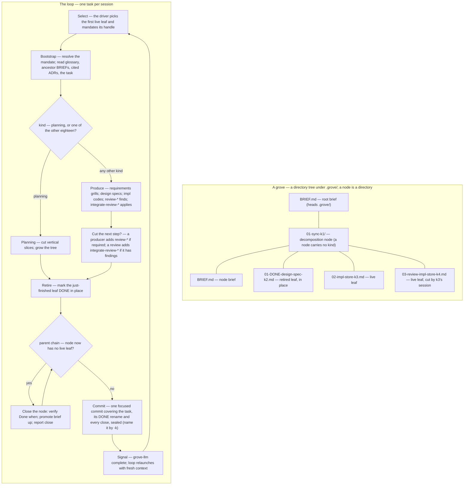

<!-- unit: skill kinds=* class=triggering -->

# grove — hierarchical, self-extending workstreams

A **grove** is one workstream driven as a VCS-tracked **tree of task files**,
one task per session. Planning tasks grow the tree as understanding deepens;
completed leaves are marked done in place. The tree's shape — the directory tree
under `.grove/` — is the only state; the VCS holds the history.



## The spine — seven constraints

grove drives long work *without* becoming brittle, constraining machinery.
These seven rules are non-negotiable; everything below is subordinate to them.

1. **Artifacts, not state.** No phase file, no session log, no status file.
   The directory tree under `.grove/` is the only state; the VCS holds the
   history.
2. **Read, don't run.** A session bootstraps by *reading markdown* — no script
   must succeed before work begins. Its one command, `grove-llm resolve
   <handle>`, is a lookup you could do by eye: the handle is in the filename.
   (Keeping this skill in step with the `grove-llm` it instructs is the `grove`
   binary's own job — it *embeds* this methodology at build time and
   re-provisions it on every lifecycle invocation, so the skill you are reading
   and the verbs on your `PATH` are always the same build. The boundary is that
   build, not a commit: in a grove *of grove*, editing `content/` changes
   nothing any session reads until the binary is rebuilt and installed.)
3. **Suggested shape, not enforced schema.** Task files and briefs are freeform
   markdown. The format files are guides; nothing validates them.
4. **Lazy and optional.** Every artifact — brief, ADR, spec, glossary entry — is
   created only when it earns its place, never because a step demands it. Lazy
   means *just-in-time, not few*: a tree that keeps sprouting small, concrete
   leaves is healthy, not a smell.
5. **grove guides, it does not gate.** grove never refuses to proceed. A task
   may be done by hand, reordered, or skipped.
6. **Walk-away-able.** Delete this skill and `.grove/` is still a legible
   folder of notes; every durable output is standard, team-readable markdown.
7. **One page of rules.** If the loop below does not fit on a page, it is too
   complex — cut until it does.

## The loop

One task is one session. A grove runs in **a working tree the user
provides** — git or jj-enabled (a `.jj/` present, colocated or native); a main
checkout, linked git worktree, or jj workspace; on any branch, anywhere on
disk; grove reads no branch and no bookmark anywhere (user-owned-worktrees).
The grove's name is that working tree's directory basename, and its task tree
lives at `.grove/` inside it.

Sessions are launched by the `grove` CLI (installed via `brew install Linkuistics/taps/grove`): run **bare `grove`** from inside the working tree — no subcommand, no flags. That is the whole human surface *and* the sole lifecycle entry: it inspects the state on disk and dispatches. No `.grove/` yet → it scaffolds the tree and launches its first `requirements` leaf; a live tree → the next leaf; no ordinary work left → it appends one `finish` leaf and launches that. If the tree is in an older format — the original `NNN-slug/` directories, the v1 flat dotted-decimal scheme, or the pre-session-kind filenames — the first bare `grove` **migrates it** before driving, as one recoverable transaction and one focused, reviewable commit; migration is idempotent once a tree is current-format, and there is **no** transitional dual-format reader (task-tree-scheme).

Bare `grove` drives the **whole loop**, not one task (self-driving-loop). It is a thin, stateless **self-driving loop**: launch one fresh foreground harness session (owning the real TTY, so grilling / resize / Ctrl-C are all native), and when that session ends, **relaunch with fresh context** — but only if the agent fired the completion signal. That makes each task a clean-context session without a manual `/clear`+relaunch crank. **Relaunch is opt-in:** any other exit — your `/exit`, the human's Ctrl-C, or a crash — **stops** the loop, resumable later by re-running `grove` from the same working tree. Because the loop body holds zero engine state and re-derives its position from the tree every iteration, **restart ≡ continuation** by construction; a task that crashes before its retire-and-commit boundary leaves its leaf live and is simply re-selected and redone. There is no PTY wrapper and no daemon — a plain shell `while` loop could stand in (constraint 6).

**One configuration, no other launch policy.** Every session is launched by
`~/.config/grove/config.kdl`, which gives each session kind exactly one complete
command template. That template chooses the executable or wrapper and every
user-controlled argument — harness, model, reasoning effort, approval,
permission and sandbox policy — and grove neither knows nor infers which harness
it eventually reaches: it reads the selected leaf's kind from the filename,
looks that one kind up, expands its own substitutions, and executes the result
directly (no shell). `${prompt}` carries this launcher plus your mandate;
`${session_name}`, `${worktree}` and `${repo}` are the only others. **Nothing
else routes a session** — no environment variable, no command-line flag, no
repository stamp, no field in a task file, and no default, family or fallback.
Grove never creates or edits that file, because it cannot choose personal model
or wrapper policy, and it re-validates the whole file before every tree mutation
and again before every launch: an edit lands on the next session, and an invalid
file launches nothing while leaving the selected leaf live and resumable.

The driver computes this grove's session name — `<repo-basename>: <name> grove` — and offers it to the configured command as `${session_name}`; it never renames a session itself. If your template does not pass it and the session name doesn't already match, suggest `/rename <repo-basename>: <name> grove` once per session and move on. The skill can derive both names: `<name>` from the working tree's own basename (`jj workspace root` in a jj-enabled tree; `git rev-parse --show-toplevel` otherwise), `<repo-basename>` from the **main repo**'s basename (`jj workspace root --name default`'s basename in a jj-enabled tree, or `git rev-parse --git-common-dir`'s parent — the repo a linked worktree or secondary workspace belongs to, not the working tree's own path).

**Starting a new grove.** Provide a working tree by whatever means you
like — `git init`, `git clone`, `jj git init --colocate`, `jj git clone`, a
plain checkout, a linked worktree or jj workspace (`jj workspace add`), or
your own tooling (e.g. [worktrunk](https://github.com/max-sixty/worktrunk)) —
then run bare `grove` from inside it. **You never scaffold the tree yourself.**
A brand-new grove has a working tree but no `.grove/` yet, and every step below
assumes one exists; the driver resolves that chicken-and-egg before an agent
exists, because a rootless tree has no leaf to select and the grow verbs
(`leaf-add` and friends) all need a root too. It creates `.grove/`, the root
`BRIEF.md` stub, a first **requirements** leaf `01-requirements-<slug>-k1.md`
(default slug `plan`), and the format witness, then selects that leaf and
launches it. Creating the first *leaf*, not just the brief, is load-bearing: a
brief is not a leaf, so a brief-only `.grove/` would look like a grove with no
live work — a newborn indistinguishable from a finished one, mis-triggering the
Complete finish cycle (fresh-grove-start-contract). The kind is fixed at
`requirements`: a bootstrap session's only input is the human's own words. So
your session starts at **Bootstrap** like every other one — grill the leaf,
record the outcome in the root brief, then grow the tree, cutting the leaves
yourself if the workstream is small and otherwise adding a `planning` leaf for a
fresh session. The scaffold is a working-tree change only; your commit folds it
in.

**Pick.** The driver makes **one authoritative pick** per session, in-process,
before the session exists: the first live leaf in a depth-first **pre-order**
walk of `.grove/`, visiting each directory's children in per-level position
order (the `BRIEF.md` charter first — and skipped — then by numeric position)
and descending node directories in place. Briefs, terminal leaves (`DONE` and
`ABANDONED` alike) and foreign files are skipped, and a driver-owned `finish`
leaf is passed over while any ordinary work is live, becoming eligible once it
is the only live leaf. Nothing else modulates the walk — no priority, no
grouping, no set of leaves that must finish before another is considered. That
selection's **stable handle** is what the driver hands you in `${prompt}` as
your mandate.

**Do not pick again.** `grove-llm pick` remains a diagnostic and tree-interface
verb — it is how you or a human read the tree's next answer directly, the same
one `find .grove` gives by eye — but it is not this session's dispatcher. A leaf
inserted while your configured command was starting can move your leaf's *path*
and would make a second walk disagree with your mandate; the mandate wins, and
the inserted leaf is simply the next iteration's work.

**Bootstrap.** Start from the mandate. Run `grove-llm resolve <handle>` to turn
the stable `<slug>-k<key>` handle in your prompt into its current file path, and
stop if it resolves to nothing or to a terminal (`DONE` / `ABANDONED`) leaf —
that is a stale or hand-edited launch, not work to redo. Then read, in order:
the glossary (`CONTEXT.md`, or the relevant bounded context via
`CONTEXT-MAP.md`); the ADRs cited by the briefs; the `BRIEF.md` chain root→leaf,
enumerated by `grove-llm brief-chain <resolved-path>` — the verb walks that
leaf's **ancestor directories**, from the grove root down to the leaf's own
directory, and prints each level's `BRIEF.md`, one absolute brief path per line,
root→leaf (a level with no brief is skipped silently, so a node whose charter
has not been written yet still bootstraps); and the task file itself. That assembled context is the session's
entire mandate; read nothing else by reflex.

**Execute.** The **filename** states the leaf's session kind — nothing in its
body does — drawn from a closed set of **nineteen**: five producers
(`requirements`, `design`, `planning`, `prototype`, `impl`), each with its own
`review-` and `integrate-review-` step, plus `research-a`, `research-b`,
`combine-research`, and the driver-reserved `finish` (`TASK-FORMAT.md` for every
kind's discipline and its HITL/AFK mark).
**`planning` is the only kind with methodological force** —
the sole branch here, and the only kind that grows the tree generatively:
- Every other kind **produces an artifact** and differs in discipline, not in
  what the loop does with it. `requirements` opens with a **grilling session**
  (`grilling.md`): interview the user one question at a time, propose a
  recommended answer for each, walk down the design tree until shared
  understanding is reached, updating `CONTEXT.md` *inline* as terms resolve.
  `design` turns that into a spec or an ADR set; `impl` produces code, docs, or
  tests; the `review-*` kinds produce findings and the `integrate-review-*` kinds
  apply them.
- A `review-*` session is **inspection-only**: inspect the producer's committed
  changes, source, requirements or specifications, and recorded verification
  evidence. Do not run test, build, lint, or format commands, edit production or
  test code, or redo the implementation. Review output is findings only; the
  paired `integrate-review-*` task owns every fix and all post-fix verification.
- A **planning task** must first find the **smallest independently useful
  working increments** and order them by dependency, creating a separate grove
  for every obvious stage that leaves the product working and delivers useful,
  verifiable behavior for its successor. Changes that cannot independently leave
  the product working stay in one increment even when their code edits are
  separable. It then cuts the current increment into vertical slices and **grows
  the tree** (Decompose, below). It no longer interrogates — grilling moved to
  `requirements` — but it MAY still sharpen the glossary or raise an ADR inline,
  as any kind may.

**Review ownership inside a picked leaf.** This applies only after the driver
launched this session with a selected-leaf mandate in `${prompt}` and the
session adopted that mandate by running Bootstrap — a `.grove/` directory in the
checkout and inherited Grove control variables do not count. A picked plain producer may
materialise at most one reviewer across the **whole picked leaf**; each
independent diverse-lens context counts. A second need — normally re-review
after a substantive non-mechanical fix — is the signal that review has become
tree-sized work: cut a `review-<producer>` leaf with `leaf-add`, writing the
specific doubt into its body; trivia, noise, visible trade-offs, and
test-conclusive fixes do not force it. A producer that already has a review leaf
beside it, `review-*`, and every research-pair leaf
spawn none; `integrate-review-*` may spend one narrow reviewer, then externalises
substantial redesign as a new producer review chain beside the leaf it is
integrating. Outside this predicate doubt
keeps its standalone cycles. Once review is escalated to the tree grove owns the
route: it launches the `review-*` kind's own configured command, and whether that
target differs from the producer's is the configuration owner's policy — grove
records no producer target, compares none, and warns about none.

Whichever kind is running: raise ADRs *sparingly* (`ADR-FORMAT.md` for placement;
the `linkuistics:decision-records` skill for the philosophy, format, and
when-to-write test), and write a spec only at a genuine agreement point
(`SPEC-FORMAT.md`). Treat the ADR set as a **minimum coherent set describing the
current design**: when a session *changes* a decision an ADR already records,
**rework the set in place** — merge / split / delete — and reconcile the briefs
that cite it; never append a superseding ADR (the VCS holds the history). The
same rule governs `docs/specs/`, one grain coarser. See `driving.md` for the
field-guide habits that make grilling, research-leaf commissioning, and the
review chain productive (WDYT, pushback, running decision log, citation
discipline).

**Decompose.** When work surfaces mid-session, default to **externalizing it as
a new leaf** rather than absorbing it into the current session — grove's value
is many small, low-context sessions, and that value is lost the moment a session
quietly grows to cover work that should have been its own leaf. Two triggers,
two verbs:
- **A new concern** — the human raises it, or a tangent appears that does not
  serve *this leaf's stated goal* — goes to the tree with `leaf-add` (or
  `leaf-insert` when it must sequence ahead of live leaves), **never** inline.
- **The current item proves bigger** than its brief assumed — turn the leaf into
  a node (a brief, `BRIEF-FORMAT.md`, and ordered child leaves) with
  `leaf-decompose`, doing **only the first child** this session, each child
  shaped as a vertical slice that stands demoable on its own (`driving.md`).

Continue inline **only** while the work still serves this leaf's stated goal
*and* fits one focused, low-context session — the bar is *"fits this session,"
not "I can finish it."* Decomposition stays lazy (constraint 4): grow the tree
just-in-time, at the genuine seam, never speculatively.

**Cut the next step, when it is needed.** When more than one leaf serves *one*
artifact, two shapes are the habitual answer — reach for them by default, and
argue yourself *out* of one rather than into it. They are built in **opposite**
ways, and the asymmetry is the design:

- **The review chain** — `X` → `review-X` → `integrate-review-X`: a fresh
  context asked to *disprove*, then a leaf licensed to act on what it found. Its
  steps are **ordinary flat siblings**, and **each session creates the next, only
  when it is required**:

      grove-llm leaf-add <parent> <stem> --kind review-<producer>
      grove-llm leaf-add <parent> <stem> --kind integrate-review-<producer>

  The **last act of a producer session** is to decide whether review is required
  and, if so, cut the `review-<producer>` leaf itself. The **last act of a review
  session** is to cut the `integrate-review-<producer>` leaf — **only if it has
  findings worth acting on**. A review that finds nothing creates nothing and
  simply retires; that empty session is the one this shape exists to remove.
  Decide for review when the artifact is load-bearing — a spec, a decomposition
  you will build on for months, a subsystem. One narrow, unexpected doubt in a
  picked plain producer may use its single in-session reviewer instead
  (`driving.md`).

  **You write the new leaf's body, and that is the payoff.** Because the leaf is
  cut by the session that knows why it is needed, it can carry **specific
  instructions, findings and data** — a review leaf naming the exact case its
  producer could not cover, an integrate leaf carrying the findings verbatim.
  That is strictly more than the generic template a constructor could write up
  front, and it is why the creating session is the right author. The template
  you get is bare on purpose: a handle and empty sections, nothing to edit
  around.

  You name the step kind yourself, so **name it off the producer**:
  `review-<producer>` and `integrate-review-<producer>`, for the producer that
  actually ran. `--kind review-impl` beside a `design` producer is a perfectly
  valid invocation that silently gives the reviewer the wrong discipline, and
  nothing will catch it. Each step resolves its own `review-` /
  `integrate-review-` configuration entry, so the kind is the whole routing
  decision.

- **The vendor pair** — `research-a` → `research-b` → `combine-research`, the two
  surveys differing *only* by which configured target runs them. Cut it when the
  question is load-bearing enough to pay for two corpora. **This one is still
  one eager call**, and the whole shape lands or none does:

      grove-llm leaf-add-pair <parent> <stem>

  **Laziness would be wrong here, which is why the pair kept its verb.** If
  `research-a` cut `research-b` at the end of its own session, `b` would inherit
  `a`'s framing and corpus — destroying the independence the pair is run for.
  Eagerness is the point for a pair; it is not for a chain. The two producers are
  **separate session kinds**, so each resolves its own configuration entry and
  neither task file carries routing metadata. The tree guarantees two independent
  sessions and the combine discipline; whether they reach two genuinely different
  vendors is the configuration owner's policy, not something grove can recover
  from an opaque command template.

**Neither shape gets a node directory.** A node means *this work proved bigger
than one session*, and its `BRIEF.md` is the context those extra sessions need; a
composed shape has no such context, and the hierarchy a node bought was not worth
the navigation cost. So a shape's steps sit as flat siblings among their
neighbours, and **every node in the tree carries a brief** again — there is only
one node species, and Retire's close has the same work to do at every one of
them.

**Every step of a shape carries the same bare stem** — no `-review`, no
`-integrate`, no `-a` / `-b` / `-combine`. **The kind field is the canonical
statement of a leaf's role; the slug names the artifact and does not restate the
kind.** A step marker in the slug was a 1:1 restatement of the kind sitting right
beside it — a second, *unvalidated* source of truth for a fact grove already
parses and routes on. Nothing stops `leaf-add <parent> foo-review --kind impl`,
and when the two disagree the slug lies while the filename tells the truth. So a
chain reads `<stem>` / `<stem>` / `<stem>`, three leaves differing only by kind
and key, and `grove-llm resolve <stem>` prints the whole chain with each step's
role spelled out in its path. Both spellings remain legal filenames, the grammar
is unchanged, and **no existing tree is invalidated** — an older suffixed slug
you meet is fine and stays as it is (`TASK-FORMAT.md` carries the full reasoning).

**Declare the relationship in the body, by hand.** A review's body carries
`**Reviews:** <producer-handle>` and an integration's carries `**Integrates:**
<review-handle>` (`TASK-FORMAT.md`). Nothing writes those lines for you and
nothing parses them: they are a **convention for the human and the next session**,
which is constraint 3 — task files are freeform markdown and nothing validates
them.

**The grammar is five fields; no relationship is one of them.** Grove parses
every task-shaped leaf name into exactly `NN`, an optional `DONE` / `ABANDONED`
infix, one member of the closed kind set, the slug, and `-k<key>` — and all five
are load-bearing: position orders the walk, the infix filters terminal leaves,
the kind routes the launch, and slug-plus-key is the stable handle `resolve`
finds and the counter `leaf-add` reads. What grove infers from *none* of them is
a **relationship between leaves**: a `review-*` kind does not make a leaf review
its neighbour, an `X` requires no `review-X` after it, and a partial chain is
never rejected. The shared stem is a habit that makes a chain legible to you and
to `find .grove`; it is not grammar. That is exactly why a *step marker* in the
slug was worth deleting and the stem was not: the stem names the artifact, which
nothing else in the name does, while a marker only restated the kind — and an
unparsed convention that duplicates a parsed field is the one kind of convention
that can be wrong.

**A chain is not contiguous by construction, and only one of its two hops needs
protecting.** Steps are appended at the parent's next free position, so a step
cut after some unrelated leaf already exists lands *after* that leaf, and a later
`leaf-insert` can split a chain that was contiguous. Grove refuses none of
it — it validates no cross-leaf grammar, `pick` is a walk and not a scheduler,
and contiguity was never an enforced unit. What decides whether a gap costs
anything is **what the next step consumes**:

- **A `review-*` step re-derives, so `leaf-add` is right wherever it lands.** Its
  handoff is the producer's **stable handle**: the review's own body names it
  under `**Reviews:**`, every task commit message names the work item by that
  handle, so the reviewer finds the producer's commit from the handle and reads
  that diff against the current source. Nothing had been written down for
  intervening work to stale. That is narrower than *free* — work that rewrote the
  reviewed artifact, its requirements, or its recorded evidence leaves the
  reviewer reconciling a historical diff with a tree that has moved — but the
  reconciliation is visible, and the reviewer performs it deliberately.
- **An `integrate-review-*` step consumes, so a gap corrupts.** A review's
  findings are anchored to a commit and to `path:line` coordinates, and the
  integrating session opens the working tree as it *then* stands. Any intervening
  edit to a cited file moves those lines, and the drift is **silent**: nothing
  errors, the finding simply points somewhere slightly wrong, and the integrating
  session has to re-derive what the reviewer meant from a codebase the reviewer
  never saw.

So an integration is cut **where `pick` reaches it next**, and the condition for
that is mechanical and **directory-local**. Read the review's *own parent*
directory at the entries after the review's position, and find **the first
sibling entry after the review whose subtree still holds live work** — leaf file
or node directory, whichever comes first. That entry is what blocks, and it is
the insert target:

```text
grove-llm leaf-insert <first blocking sibling entry> <stem> --kind integrate-review-<producer>
```

Three things that condition gets right where "the first live leaf after it" does
not:

- **Terminal entries never block.** A later `DONE` or `ABANDONED` leaf, and **a
  node whose subtree is wholly terminal**, are stepped straight over; so is the
  driver's `finish` sentinel, which is skipped while any ordinary work is live.
- **A later sibling *node* blocks as one entry, and the node is the target.**
  `pick` descends a node in place, so a live leaf anywhere beneath a later
  sibling node runs before anything appended after that node. Insert at the
  **sibling directory**, never the live leaf inside it — targeting the descendant
  inserts at the wrong level, dropping the integration inside a node whose brief
  does not charter it.
- **Nothing outside the directory can intervene.** Pre-order finishes the
  review's own directory — including an integration just appended to its end —
  before it visits any later sibling of an *ancestor*. So live work in an outer
  sibling node is irrelevant, and when no sibling entry blocks, plain `leaf-add`
  is exactly right.

**There is no exception to check.** Adjacency is unconditional guidance, not
because departing is forbidden — grove enforces none of this — but because the
check an exception would need cannot be performed: at the moment a review cuts
its integration the intervening leaf has not run, and grove makes no leaf's
eventual file set part of its contract, so a goal or pointer list is not proof of
what it will touch. A session that departs anyway owns the drift.

**When a picked producer needs fresh review**, the answer is the same
`leaf-add`. Finish to a reviewable boundary, cut the `review-<producer>` leaf
with the specific doubt written into its body, retire the producer, and commit
the artifact plus that leaf plus the retirement under the producer's handle —
the Retire-then-Commit order below. Retiring it is the filename `DONE` transition
and nothing else, and it leaves the review byte-identical, because the review
needs no record of how its producer ran. The next loop iteration picks that
review and resolves its command from the `review-*` entry in configuration.

The tree is a real **directory tree** under `.grove/`: a node is a **directory**
`NN-<slug>-k<key>/` holding its numbered children (`01-…`, `02-…`), headed by a
`BRIEF.md` charter — a node is always a leaf that *decomposed*, so it always has
one; the filesystem carries the hierarchy, and `.grove/` is
itself the root node. Convert the leaf by running `grove-llm leaf-decompose <leaf-path>
<first-child-slug>`: the verb moves the leaf file
`NN-<session-kind>-<slug>-k<key>.md`
(`git mv`; a plain rename in a jj-enabled tree, where jj snapshots the working
copy) into a new directory `NN-<slug>-k<key>/` as its `BRIEF.md` (**keeping its permanent
key `-k<key>`** — the leaf that was `k<key>` becomes the *node* `k<key>`, same
position and slug, and **dropping the kind**, which a node has no use for),
retitles the brief's position-free `# <slug>-k<key>` header
with ` — brief`, and atomically grows the node's first child
`01-<session-kind>-<first-child-slug>-k<new>.md` (a node is never childless). Reshape the brief
body afterwards if needed (that part is judgement; the verb only does the
mechanical move). Grow the node further by running `grove-llm leaf-add <parent>
<slug>` (parent `.` for the grove root, or a node by its key or path) to append
a leaf at the node's next free child position with a fresh key (the common
case), or `grove-llm leaf-insert <target> <slug>` when a new concern must
sequence *ahead* of existing leaves — the insert verb shifts the target and
every later sibling up one position. Because the hierarchy lives in directories,
that shift is a single move of each sibling **directory** (`git mv`, or a plain
rename under jj) and the whole
subtree — child names *and* keys — rides along untouched; in-file `# …` headers
are position-free, so the renumber rewrites **zero file contents**. The verb
surfaces any stray **position-prefixed** cross-reference (`05-mid-k14`) on
stderr for the operator to review (it does not auto-rewrite — references may be
intentional historical pointers). Prefer the **permanent key** for any durable
cross-reference: a key never moves under renumber or a slug edit, and `grove-llm
resolve <ref>` turns a key (`[n]` / `n`), a bare slug, or the full
`<slug>-k<key>` handle back into the current file path. Every grow verb is a
working-tree change only; the enclosing task's commit folds them in.

**`--kind <kind>` appears on the grow verbs whose kind is a free choice**, and
every one that accepts it gates on it: an unrecognised value errors and lists the
nineteen, and driver-reserved `finish` is refused, because a human is present at
authoring time. `grove-llm leaf-add <parent> <slug> --kind <kind>` and
`grove-llm leaf-insert <target> <slug> --kind <kind>` take it with the `impl`
default — and since a review chain is now cut one `leaf-add` at a time, `--kind`
is where you name `review-<producer>` and `integrate-review-<producer>`
yourself, off the producer that actually ran. `leaf-decompose` takes it as an
*override* of the kind it otherwise inherits from the leaf being decomposed — the
node directory it creates carries none — so a `research-a` leaf that proves
bigger keeps producing `research-a` work in its first child. **`leaf-add-pair`
takes no `--kind` at all**: its three kinds (`research-a`, `research-b`,
`combine-research`) are fixed by the shape, so there is nothing to choose.
**Reading is strict too**: every task-shaped leaf
filename, live or terminal, must carry a known kind, and a missing or unknown one
stops tree operations naming the path and the valid set rather than degrading to
`impl` — the kind is a configuration key, and a kind grove cannot spell is a
session it cannot launch. No grow verb
selects a harness, a model, or anything else about the launch: the kind is the
whole routing input, and configuration maps it to one command.

**Retire.** A leaf ends one of two ways — **done** (the work was completed) or
**abandoned** (the path was decided against); grove's own metaphor: a done leaf
is *harvested*, an abandoned one is *pruned*. Both mark the leaf **in place**,
neither ever deletes it, and both are skipped by `pick`.

The common case: with the task's work done — and *before* you commit it, so the
rename and everything the cascade below writes land inside that one focused
commit — retire the just-finished leaf by
running `grove-llm leaf-retire <leaf-path>` — the verb marks it done **in
place** by adding a `DONE` infix (`NN-<session-kind>-<slug>-k<key>.md` →
`NN-DONE-<session-kind>-<slug>-k<key>.md`, the infix sitting right after the
position so the kind stays where every reader looks for it); there is no `done/`
directory, and the leaf keeps
its position and key in its directory. The infix is filename-only — the file's
contents (including its `# <slug>-k<key>` header) are untouched. Mechanical
bookkeeping, no need to ask.

Retirement touches **one filename and nothing else** — not the leaf's own body,
not a sibling, not an ancestor. A leaf that a review is waiting on is no
exception: the review reads the committed artifact, so there is nothing about the
producer's session for retirement to hand it.

The other case: a session finds the leaf's path decided against, not done. This
is **pruning**, and it is **HITL — an agent never prunes on its own**: an AFK
session (every kind but `requirements`, `prototype` and `finish`) that discovers
this says so and stops; the
loop stalling on an abandonment decision is the system working, not a fault.
Only on explicit human confirmation, run `grove-llm leaf-prune <path>` (a leaf
or a node — given a node it marks every live leaf in the subtree, leaving `DONE`
ones alone, and refuses the grove root) to mark it `ABANDONED` in place.
Pruning a reviewed producer leaves any review leaf beside it live, next, and
deliberately uncheckable — nothing was produced for it to read. A chain is flat
siblings, not a node, so there is no enclosing directory to prune in one call: if
the human is abandoning the whole reviewed path, prune each of its live steps.
Usually there is only one — a review leaf exists only when a producer already
decided review was required, and an integrate leaf only when that review found
something.
`.grove/` dies at the finish cycle, so the mark records only *that* the path
closed — the durable *why* (what was rejected, why, and what would reopen it)
goes to the **ADR set**, the positive fact the abandonment establishes, if it
clears the when-to-write bar; otherwise the mark and the commit message suffice
(pruning).

Then walk the parent chain: if a node now has no live leaf left in its subtree —
however its leaves finished — it is **implicitly done** — a brief is context,
not a task, so it is never marked done; its done-ness *is* the absence of a live
child. **The close asks the human nothing.** A node is
never marked, and nothing else on disk moves with it either — no infix, no
sibling, no review. Grove enforces the "no infix" half rather than trusting you
to remember it: a positioned, keyed *directory* name is task-shaped, so one
hand-marked `DONE` makes it a malformed tree the verbs refuse by name — not a
foreign entry they skip along with every live leaf beneath it. A question there
would have gated an *inference*, and
`leaf-add` reopens a close made in error anyway. That
is the first of the two tests deciding where grove *does* ask;
confirmation-boundary carries both, and the second is why pruning and the
finish cycle still do.

Instead the session **verifies and reports**. Every node carries a `BRIEF.md`
— it is a leaf that proved bigger, and the charter is what those extra sessions
needed — so every close has the same four steps:

1. **Check** the node's brief `Done when` against what its subtree delivered.
2. **`leaf-add`** the missing work if the check fails and you can name the gap —
   a failed check names *work*, and grove has one answer for missing work.
3. **Escalate** — stop and say so — if the check fails and you *cannot* name the
   gap, because the residue is a scope judgement rather than work. That is an
   ordinary escalation, discretionary and always legitimate, not a routine gate.
4. **Promote** anything still relevant from the brief upward — to the parent
   brief, an ADR, or the glossary — so it stays in the brief chain of future
   siblings; and **report** the close by naming the node's `<slug>-k<key>` handle
   in the commit message alongside the leaf's own. The human reviews the close
   after the fact, in the diff. The brief and its now-terminal leaves stay
   exactly where they are (nothing moves).

If you meet a node whose charter was never written, do steps 2–4 and skip step
1: there is no `Done when` to check and nothing to promote. That is a lapse in
the tree, not a second species — grove writes no brief-less node.

Retirement is also the moment to **reconcile the ADR set**
with what the finished work established: edit it in place to keep it a minimum
coherent set (merge / split / delete), and fix any citation the rework leaves
dangling — in the briefs, the other ADRs, or `docs/`; never append a superseding
ADR (`linkuistics:decision-records`). That may leave the next ancestor with no
live leaf either; re-check and recurse, until a node still has a live
leaf or you reach the grove root — silently, so an unattended run crosses a whole
chain of closes without stopping. Terminal branches stay in the tree, marked in
place, never deleted while the grove is live — so a recursive view of `.grove/`
(`find .grove`, or a tree-style file manager) shows the whole state, done and
abandoned alike. The cascade walk and the brief-promotion-upward stay prose
deliberately: both are judgement steps (does the `Done when` hold? what survives
upward?) with no stable input/output shape that would justify a verb.

**Commit.** One task = one focused commit — and *one task* means the whole
session's work: the artifact, whatever the grow verbs wrote, and the `DONE`
rename that retires the leaf, together with anything the cascade above promoted
or added. **This is why Retire comes first**: everything the commit must contain
has to be on disk before the boundary closes, and the message cannot name a node
you have not yet closed. **Name the work item in the commit message by its
stable handle `<slug>-k<key>`, never by its position or directory path** —
positions and paths move under renumber and reorder, but the `<slug>-k<key>`
handle is permanent, so the historical record stays meaningful after
restructures (task-tree-scheme §5). Name each node the cascade closed the same
way, alongside the leaf's own.

That commit is also the boundary the *next* session starts from, and git and jj
reach it differently — the same asymmetry the tree verbs already carry (`git mv`
there, a plain rename under jj). In **git** the working tree is not history, so
one `git commit`, taken once the rename has landed, both records the task and
leaves the next session a clean tree. In **jj** the working copy *is* a commit:
this session's edits are already in `@`, so `jj describe -m` records the task but
leaves that change open, and the next session's first edit is snapshotted into
*this* task's commit. **Seal it** — `jj new` after describing, once the rename
has landed (`jj commit -m` is exactly those two) — so the next session opens on
its own empty change. Sealing is the last thing the boundary does, for the same
reason Retire precedes it: a `jj new` taken early puts every later edit —
the rename, a promoted ADR, a `leaf-add` — into the *next* task's change. An
unsealed change is expensive to unpick afterwards:
`jj split <fileset>` cannot separate a file both tasks touched, leaving the
operation log as the only way back. The lane itself belongs to
`linkuistics:using-jujutsu`; grove states only where its boundary falls.

**Signal.** Once the task is retired and committed (and any parent-chain cascade
is settled and included), run **`grove-llm complete`** as your **last action — then do
nothing else**. This is how the self-driving loop ends this session and starts
the next task with fresh context: the verb only writes the relaunch flag to a
signal file (`GROVE_SIGNAL_FILE`) and returns. Ending the session is the **loop
driver's** job, not this verb's — the driver launched this session and is
watching for the signal file while it runs, so it applies grace → SIGTERM →
kill-grace → SIGKILL to its own child once the file appears (driver-side
watcher: the driver can always signal its child, unlike an in-agent self-kill,
which some harness sandboxes — e.g. codex's Seatbelt — silently deny). Run
outside a `grove` loop (no `GROVE_SIGNAL_FILE`) it is a safe no-op that just
tells you to exit manually. Plain `complete` signals a
**relaunch**; the **Finish** cycle below ends instead with **`grove-llm complete
--done`**, which signals a clean *stop*. The loop tells the three cases apart by
the signal: a relaunch flag, a `--done` flag, or no flag at all (a crash /
Ctrl-C, which stops).

**Finish.** You do not discover that a grove is finished — the driver does, and
it tells you by launching you. Once no ordinary live leaf is left, bare `grove`
appends one driver-owned `finish` leaf at the grove root and mandates it under
the `finish` session kind; that mandate *is* the signal, so a finish session
never asks `pick` anything. The leaf is a real, **resumable** task: it carries
its own stable handle (`finish-k<key>`, which step 2 needs), and it is created
once and reused, never duplicated. Declining teardown — or ending before step 2
begins — exits without a completion signal and leaves the leaf live and next, so
the following bare `grove` proposes the cycle again. Ordinary work inserted
ahead of it (`leaf-insert`) makes the driver pass it over until that work is
terminal, so the sentinel can neither starve nor preempt real work. The
**complete finish cycle** itself is driven in-session by the LLM
(no Rust automation): the session **proposes** it and **waits for explicit human
confirmation before any teardown** — never run steps 2–3 unprompted, so a
headless run with no human present simply reports the plan and stops. This is the
loop's **only routine human gate** (confirmation-boundary) — everything else
a session asks is a discretionary escalation. On confirmation, run:

1. **Promote** anything from the briefs that should outlive the grove — ADRs,
   docs, glossary entries. Reviewable working-tree edits; often a near no-op
   when decisions landed inline as they were made.
2. **Tear the tree down with `grove-llm finish-commit <finish-handle>`** — the
   live `finish` leaf's stable handle, e.g. `finish-k42`. Never delete `.grove/`
   by hand and commit it yourself. The helper revalidates the live finish and
   the absence of new work, then runs teardown as **one fail-closed
   transaction**: the tree is evacuated beneath a `.grove/FINISHING-<handle>/`
   witness and stays visibly present until the repository proves the exact
   `.grove/`-scoped commit named by that handle and this launch's finish-attempt
   identity; only then does the whole root move, in one atomic rename, to a
   cleanup quarantine. **An absent `.grove/` never proves teardown
   succeeded** — a death before the commit exposes exactly that shape, which is
   why the by-hand version is unsafe (ADR *task-tree-transactions-fail-closed*).
   Every reported failure is retryable: an uncommitted one restores the live
   finish tree, so just rerun the same command. If the diagnostic says
   **`Recovery pending`**, stop and hand it to the human — it names the artifact
   holding the blocked transaction, the recorded and observed topology, and the
   two operator exits (restore the recorded start to roll back, or make the
   exact teardown result immediate to finish forward). Grove never rewrites
   history to clear it, and neither should you.
3. **End the loop cleanly**: run **`grove-llm complete --done`** as the **very
   last** action, then do nothing else. This signals the self-driving loop to
   *stop* (vs the per-task `complete`, which relaunches), so a clean finish is
   distinct from a crash or Ctrl-C. It must come last: like the per-task signal
   it ends this session after a short grace (applied by the loop driver, which
   is watching for the signal file — not this verb), so running it any earlier
   would cut teardown short. It writes only the launch's randomly named loop
   signal file in the workspace's VCS-administration control directory —
   nothing in the working tree. It still resolves the current directory to
   verify the live session epoch, so run it from inside that session's working
   tree (which remains valid after `.grove/` is deleted).
   Outside a `grove` loop (no loop to stop) it is a safe no-op: just exit.

Nothing after: integrating the grove's branch and tearing down the working tree
are **not** grove workflow — both belong to plain git/gh or jj, or the user's
own worktree tooling (user-owned-worktrees). Whoever integrates does so after step
2, so the integrated history never carries `.grove/`.

**Resume is state-checked, never a marker file** (constraint 1) — and the state
that gets checked is the *repository's*, never task-root absence. If you lose
step 2's result, rerun `grove-llm finish-commit <finish-handle>` with the same
handle: with `.grove/` already gone it verifies the immediate VCS result rather
than trusting the absence, and reports idempotent success only for an exact
handle-and-attempt-named commit whose sole change is deleting `.grove/`.
Success there means step 2 is done — go to step 3. A refusal means teardown did
*not* complete, however rootless the tree looks; report it and stop. That proof
is bound to this launch, so it is available only to the still-confirmed session
that ran the command — a later bare `grove` into a rootless tree is an ordinary
fresh grove, not a resumed finish.

**Ending after step 2 but before step 3 is an ordinary no-signal stop.** The
driver reports the child's real status and elapsed time and stops the loop; it
never reads a deleted `.grove/` as the `--done` you did not send. Nothing is
lost — the teardown commit is already in history — and nothing is pending: there
is no half-finished grove to resume, only a working tree without one. Likewise
if the *driver* dies after the commit, the `done` it never got to read is
coordination debris, not a receipt: the next invocation invalidates the dead
launch's session epoch, clears that channel, and — finding no task root — starts
a **new** grove at `plan-k1` (a handle a new tree may reuse; the epoch, not the
key, is what keeps the old session's `grove-llm` calls off it). If an orphaned
command from the dead session still holds a session-epoch guard, that invocation
waits up to 30 seconds and then stops on a timed-out-epoch-handoff error rather
than proceeding — creating no `.grove/`, so a stall there is the guard, not a
hung grove. The invocation after it, once the guard releases, starts the new
grove.

## Artifacts

Only the task tree is grove-specific and ephemeral. Everything else is a
standard artifact that outlives grove (constraint 6).

| Artifact | Path | Role |
|---|---|---|
| Glossary | `CONTEXT.md` (+ `CONTEXT-MAP.md`) | the Ubiquitous Language — read every session, appended inline |
| ADRs | `docs/adr/<slug>.md` | one decision each, as a **minimum coherent set** — slug-named, edited in place; philosophy per `linkuistics:decision-records` |
| Specs | `docs/specs/<slug>.md` | how an area works — the human-facing agreement point, also a **minimum coherent set** (`SPEC-FORMAT.md`) |
| Task tree | `.grove/` (inside the grove's working tree) | the process: the self-extending decomposition of work; deleted at the in-session Finish step |

**The glossary is load-bearing.** The acute failure mode of multi-session work
is terminology drift: a later session, with no memory of an earlier one,
reinvents its term under a new name or reuses the words with a shifted meaning.
`CONTEXT.md`, read every session and appended *inline* whenever a term is
resolved, is the forcing function against that. Keep it a glossary and nothing
else — terse definitions, aliases-to-avoid, no implementation detail
(`CONTEXT-FORMAT.md`).

**Briefs vs. the glossary.** A bounded context is a *domain* partition; a
task-tree node is a *process* partition. They are orthogonal axes. The glossary
is per-bounded-context; a node that carries anything carries a `BRIEF.md`, not a
glossary.

## Specs

A **spec** is the human-facing, team-shareable design of an area of the system,
produced lazily by a `design` task *when the increment is a genuine agreement
point*. The flow there: grill → spec (review & agree) → decompose → execute.
Specs live in `docs/specs/<slug>.md` and, like ADRs, are a **minimum coherent
set describing the current design**: edited, merged, split in place; deleted
when one no longer describes anything (constraint 1 — the VCS holds the past).

Two rules keep the set honest. **Membership:** would a session on an unrelated
future grove need to read this? If not, it is a `BRIEF.md` and it dies with
`.grove/`. **Grain:** an ADR records one decision and its trade-off; a spec
describes how an area works, and *cites* the ADRs in its area rather than
restating them. Shape and the seam-sketching rule: `SPEC-FORMAT.md`.

## Reference files

- `BRIEF-FORMAT.md` — the `BRIEF.md` shape.
- `TASK-FORMAT.md` — the leaf filename grammar, the closed nineteen-kind session taxonomy, and the task-file shape.
- `CONTEXT-FORMAT.md` — the glossary format (bundled from `mattpocock/skills`).
- `ADR-FORMAT.md` — grove's ADR **placement** note: where ADRs live, slug-named `docs/adr/<slug>.md`. Philosophy, format, and the when-to-write test live in the `linkuistics:decision-records` skill (see the prerequisite note below).
- `SPEC-FORMAT.md` — the spec shape, the membership and grain rules, and where agreed test seams are recorded. Seam philosophy lives in the `linkuistics:codebase-design` skill.
- `grilling.md` — the grilling procedure for `requirements` tasks (bundled).
- `driving.md` — field guide for driving grove sessions well: when to commission prior-art research, how to write a research-leaf brief, grilling moves (WDYT, pushback, running log), and when research findings retire into ADRs.
- `prompts/continue.md` — the single launcher the `grove` binary embeds in every session's `${prompt}`, ahead of that session's mandate. There is no `start.md`, `retire.md` or `finish.md`: one bare command drives every kind of session, so one launcher covers them all.

**Prerequisite — the `linkuistics` plugin.** Three bodies of guidance grove
leans on live in a **separately installed** plugin, and grove **requires** it:
ADR philosophy in `linkuistics:decision-records`, what a test seam is and how to
judge one in `linkuistics:codebase-design`, and the working-copy-as-commit lane
in `linkuistics:using-jujutsu`, which the Commit step cites rather than
restates. The plugin is developed in grove's own repo (`plugins/linkuistics/`),
but the `grove` binary provisions only grove's methodology — never the plugin —
so it is installed on its own, through the Claude Code marketplace or the repo's
`plugins/install.sh`. Self-containment is not a constraint for any of the three:
`ADR-FORMAT.md` and `SPEC-FORMAT.md` keep only grove's placement and recording
conventions, and the Commit step keeps only where its boundary falls. A session
raising or reworking an ADR, sketching a spec's test seams, or driving a
jj-enabled tree should consult the matching skill. The dependency is
documentation-level, not install-enforced; everything else grove needs stays
self-contained (constraint 6).
