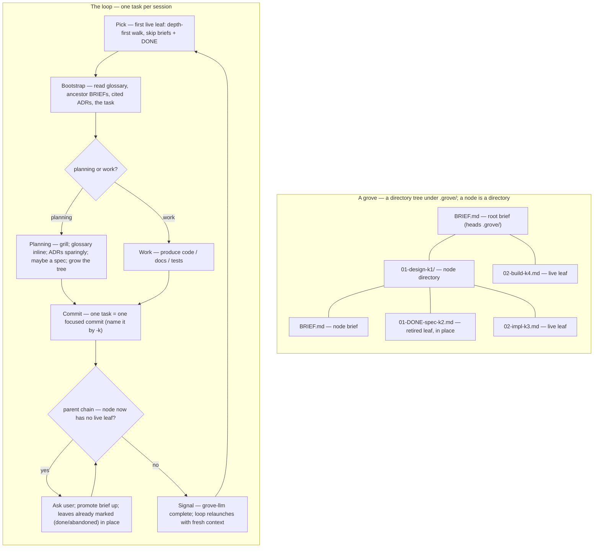

# grove — hierarchical, self-extending workstreams

A **grove** is one workstream driven as a git-tracked **tree of task files**,
one task per session. Planning tasks grow the tree as understanding deepens;
completed leaves are marked done in place. The tree's shape — the directory tree
under `.grove/` — is the only state; git is the history.

## The spine — seven constraints

grove drives long work *without* becoming brittle, constraining machinery.
These seven rules are non-negotiable; everything below is subordinate to them.

1. **Artifacts, not state.** No phase file, no session log, no status file.
   The directory tree under `.grove/` is the only state; git is the history.
2. **Read, don't run.** A session bootstraps by *reading markdown* — no script
   must succeed before work begins. (Materialising or updating grove itself is
   a separate maintenance action and may use a script — see `VERSION.md`.)
3. **Suggested shape, not enforced schema.** Task files and briefs are freeform
   markdown. The format files are guides; nothing validates them.
4. **Lazy and optional.** Every artifact — brief, ADR, spec, glossary entry — is
   created only when it earns its place, never because a step demands it. Lazy
   means *just-in-time, not few*: a tree that keeps sprouting small, concrete
   leaves is healthy, not a smell.
5. **grove guides, it does not gate.** grove never refuses to proceed. A task
   may be done by hand, reordered, or skipped.
6. **Walk-away-able.** Delete this skill and `.grove/` is still a legible
   folder of notes; every durable output is standard, team-readable markdown.
7. **One page of rules.** If the loop below does not fit on a page, it is too
   complex — cut until it does.

## The loop

One task is one session. A grove runs in **a git working tree the user
provides** — any working tree, linked worktree or main checkout, on any
branch, anywhere on disk; grove reads no branch anywhere (user-owned-worktrees).
The grove's name is that working tree's directory basename, and its task tree
lives at `.grove/` inside it.

Sessions are launched by the `grove` CLI (installed via `brew install Linkuistics/taps/grove`): run **argument-less `grove do`** from inside the working tree. `do` is the **sole lifecycle entry verb** — it inspects the state on disk and dispatches: no `.grove/` yet → a bootstrap session; a live tree → the loop continues; no live leaves left → the session proposes the complete finish cycle (do-is-sole-lifecycle-verb). It pre-names the harness session, so the rename ritual is unnecessary in the common case. If the grove's `.grove/` is in an older format — the original `NNN-slug/` directories, or the v1 flat dotted-decimal scheme — the first `grove do` **migrates it to the current directory scheme** — one reviewable, committed change — before driving; the migration is idempotent once a tree is current-format, and there is **no** transitional dual-format reader (task-tree-scheme).

`grove do` drives the **whole loop**, not one task (self-driving-loop). It is a thin, stateless **self-driving loop**: launch one fresh foreground `claude` (owning the real TTY, so grilling / resize / Ctrl-C are all native), and when that session ends, **relaunch with fresh context** — but only if the agent fired the completion signal. That makes each task a clean-context session without a manual `/clear`+relaunch crank. **Relaunch is opt-in:** any other exit — your `/exit`, the human's Ctrl-C, or a crash — **stops** the loop, resumable later by re-running `grove do` from the same working tree. Because the loop body holds zero engine state and re-derives its position from `grove-llm pick` every iteration, **restart ≡ continuation** by construction; a crashed mid-task leaf (commit-before-retire, then signal) is simply re-picked and redone. There is no PTY wrapper and no daemon — a plain shell `while` loop could stand in (constraint 6).

If a session was started without the helpers and the session name doesn't already match `<repo-basename>: <name> grove`, suggest `/rename <repo-basename>: <name> grove` once per session and move on. The skill already knows both names: `<name>` from the working tree's own basename (`git rev-parse --show-toplevel`), `<repo-basename>` from the **main repo**'s basename (`git rev-parse --git-common-dir`'s parent — the repo a linked worktree belongs to, not the worktree's own path).

**Starting a new grove.** Provide a git working tree by whatever means you
like — `git init`, `git clone`, a plain checkout, or a linked worktree from
your own tooling (e.g. [worktrunk](https://github.com/max-sixty/worktrunk)) —
then run argument-less `grove do` from inside it. A brand-new grove has a
working tree but no `.grove/` tree yet — and every step below assumes
`.grove/` already exists. Resolve that chicken-and-egg first: a rootless grove
has nothing for `grove-llm pick` to walk (it errors `grove root not found`), and
the tree-growing verbs (`leaf-add` and friends) all need a root too. Run
**`grove-llm root-init [<slug>]`** (default slug `plan`) once: it creates
`.grove/`, the root `BRIEF.md` stub, and a first **planning** leaf
`01-<slug>-k1.md` — working-tree only, no commit (the first session's commit folds
it in), refusing to clobber an existing `.grove/`. Creating the first leaf, not
just the brief, is load-bearing: `pick` skips every brief (`BRIEF.md`), so a brief-only
`.grove/` reports `no live leaves; this grove is done` and would mis-trigger the
Complete finish cycle — a newborn grove indistinguishable from a finished one
(fresh-grove-start-contract). After `root-init`, `pick` returns the planning leaf and you enter the
normal loop below at **Bootstrap**; the launcher's `start.md` prompt names this
as step one.

**Pick.** Run `grove-llm pick` — it walks the `.grove/` directory tree
depth-first in **pre-order**, visiting each directory's children in per-level
position order (the `BRIEF.md` charter first — and skipped — then by numeric
position), descending node directories in place, and prints the absolute path of
the next live leaf (a `.md` file with no `DONE` infix). Retired (`DONE`) leaves,
briefs, and foreign files are skipped. Empty stdout (and a diagnostic on stderr)
means the grove has no live leaves and is ready to **Finish**. The walk's
*semantics* (depth-first pre-order; a node directory is fully explored before its
later siblings; skip every `BRIEF.md` and `DONE` leaf; a brief is not a leaf) are
what the verb implements; reach for them only when reasoning about the walk, not
when running it.

**Bootstrap.** Read, in order: the glossary (`CONTEXT.md`, or the relevant
bounded context via `CONTEXT-MAP.md`); the ADRs cited by the briefs; the
`BRIEF.md` chain root→leaf, enumerated by `grove-llm brief-chain` — the verb
walks the picked leaf's **ancestor directories**, from the grove root down to the
leaf's own directory, and prints each level's `BRIEF.md`, one absolute brief path
per line, root→leaf (a missing brief at any level is skipped silently — some
nodes do not yet carry one); the task file. That assembled context is the
session's entire mandate; read nothing else by reflex.

**Execute.** The task file states its kind (`TASK-FORMAT.md`):
- A **work task** produces code, docs, or tests.
- A **planning task** opens with a **grilling session** (`grilling.md`):
  interview the user one question at a time, propose a recommended answer for
  each, walk down the design tree until shared understanding is reached.
  Through that grilling, update `CONTEXT.md` *inline* as terms resolve, raise
  ADRs *sparingly* (`ADR-FORMAT.md` for placement; the
  `linkuistics:decision-records` skill for the philosophy, format, and
  when-to-write test), MAY write a spec at a genuine agreement point
  (`SPEC-FORMAT.md`), and **grow the tree**. Treat the ADR set as a **minimum
  coherent set describing the
  current design**: when grilling *changes* a decision an ADR already records,
  **rework the set in place** — merge / split / delete — and reconcile the
  briefs that cite it; never append a superseding ADR (git holds the history).
  The same rule governs `docs/specs/`, one grain coarser.
  See `driving.md` for the field-guide habits that make grilling and
  research-leaf commissioning productive (WDYT, pushback, running decision log,
  citation discipline).

**Decompose.** When work surfaces mid-session, default to **externalizing it as
a new leaf** rather than absorbing it into the current session — grove's value is
many small, low-context sessions, and that value is lost the moment a session
quietly grows to cover work that should have been its own leaf. Two triggers,
two verbs:
- **A new concern** — the human raises it, or a tangent appears that does not
  serve *this leaf's stated goal* — goes to the tree with `leaf-add` (or
  `leaf-insert` when it must sequence ahead of live leaves), **never** inline.
- **The current item proves bigger** than its brief assumed — turn the leaf into
  a node (a brief, `BRIEF-FORMAT.md`, and ordered child leaves) with
  `leaf-decompose`, doing **only the first child** this session, each child
  shaped as a vertical slice that stands demoable on its own (`driving.md`).

Continue inline **only** while the work still serves this leaf's stated goal
*and* fits one focused, low-context session — the bar is *"fits this session,"
not "I can finish it."* Decomposition stays lazy (constraint 4): grow the tree
just-in-time, at the genuine seam, never speculatively.

The tree is a real **directory tree** under
`.grove/`: a node is a **directory** `NN-<slug>-k<key>/` holding a `BRIEF.md`
charter plus its numbered children (`01-…`, `02-…`); the filesystem carries the
hierarchy, and `.grove/` is itself the root node. Convert the leaf by running
`grove-llm leaf-decompose <leaf-path> <first-child-slug>`: the verb `git mv`s the
leaf file `NN-<slug>-k<key>.md` into a new directory `NN-<slug>-k<key>/` as its
`BRIEF.md` (**keeping its permanent key `-k<key>`** — the leaf that was `k<key>`
becomes the *node* `k<key>`, same position and slug), retitles the brief's
position-free `# <slug>-k<key>` header with ` — brief`, and atomically grows the
node's first child `01-<first-child-slug>-k<new>.md` (a node is never childless).
Reshape the brief body afterwards if needed (that part is judgement; the verb
only does the mechanical move). Grow the node further by running
`grove-llm leaf-add <parent> <slug>` (parent `.` for the grove root, or a node by
its key or path) to append a leaf at the node's next free child position with a
fresh key (the common case), or `grove-llm leaf-insert <target> <slug>` when a
new concern must sequence *ahead* of existing leaves — the insert verb shifts the
target and every later sibling up one position. Because the hierarchy lives in
directories, that shift is a single `git mv` of each sibling **directory** and the
whole subtree — child names *and* keys — rides along untouched; in-file `# …`
headers are position-free, so the renumber rewrites **zero file contents**. The
verb surfaces any stray
**position-prefixed** cross-reference (`05-mid-k14`) on stderr for the operator to
review (it does not auto-rewrite — references may be intentional historical
pointers). Prefer the **permanent key** for any durable cross-reference: a key
never moves under renumber or a slug edit, and `grove-llm resolve <ref>` turns a
key (`[n]` / `n`), a bare slug, or the full `<slug>-k<key>` handle back into the
current file path. All three grow verbs are working-tree changes only; the
enclosing task's commit folds them in.

**Commit.** One task = one focused commit. **Name the work item in the commit
message by its stable handle `<slug>-k<key>`, never by its position or directory
path** — positions and paths move under renumber and reorder, but the
`<slug>-k<key>` handle is permanent, so the historical record stays meaningful
after restructures (task-tree-scheme §5).

**Retire.** A leaf ends one of two ways — **done** (the work was completed) or
**abandoned** (the path was decided against); grove's own metaphor: a done leaf
is *harvested*, an abandoned one is *pruned*. Both mark the leaf **in place**,
neither ever deletes it, and both are skipped by `pick`.

The common case: after committing the task, retire the just-finished leaf by
running `grove-llm leaf-retire <leaf-path>` — the verb marks it done **in place**
by adding a `DONE` infix (`NN-<slug>-k<key>.md` → `NN-DONE-<slug>-k<key>.md`);
there is no `done/` directory, and the leaf keeps its position and key in its
directory. The infix is filename-only — the file's contents (including its
`# <slug>-k<key>` header) are untouched. Mechanical bookkeeping, no need to ask.

The other case: a session finds the leaf's path decided against, not done. This
is **pruning**, and it is **HITL — an agent never prunes on its own**: an AFK
session (research / work / review) that discovers this says so and stops; the
loop stalling on an abandonment decision is the system working, not a fault.
Only on explicit human confirmation, run `grove-llm leaf-prune <path>` (a leaf
or a node — given a node it marks every live leaf in the subtree, leaving
`DONE` ones alone, and refuses the grove root) to mark it `ABANDONED` in place.
`.grove/` dies at the finish cycle, so the mark records only *that* the path
closed — the durable *why* (what was rejected, why, and what would reopen it)
goes to the **ADR set**, the positive fact the abandonment establishes, if it
clears the when-to-write bar; otherwise the mark and the commit message suffice
(ADR *pruning*).

Then walk the parent chain: if a node now has no live leaf left in its subtree —
however its leaves finished — it is **implicitly done** — a brief is context,
not a task, so it is never marked done; its done-ness *is* the absence of a
live child. **Ask the user before
treating it as done** — the confirmation gives them a moment to add a follow-up
leaf if the node is not actually finished. On
confirmation, promote anything still relevant from the node's brief upward — to
the parent brief, an ADR, or the glossary — so it stays in the brief chain of
future siblings; the brief and its now-terminal leaves stay exactly where they
are (nothing moves). Retirement is also the moment to **reconcile the ADR set**
with what the finished work established: edit it in place to keep it a minimum
coherent set (merge / split / delete), and fix any citation the rework leaves
dangling — in the briefs, the other ADRs, or `docs/`; never append a superseding
ADR (`linkuistics:decision-records`). That may leave the next ancestor with no
live leaf either;
re-check, ask again, recurse, until a node still has a live leaf or you reach the
grove root. Terminal branches stay in the tree, marked in place, never deleted
while the grove is live — so a recursive view of `.grove/` (`find .grove`, or a
tree-style file manager) shows the whole state, done and abandoned alike.
The cascade walk and the brief-promotion-upward stay prose deliberately: both are
judgement steps (is this node done? what survives upward?) with no stable
input/output shape that would justify a verb.

**Signal.** Once the task is committed and retired (and any parent-chain cascade
is settled), run **`grove-llm complete`** as your **last action — then do nothing
else**. This is how the self-driving loop ends this session and starts the next
task with fresh context: the verb writes the relaunch flag and forks a detached
killer that ends this `claude` after a short grace (so the call itself returns
first). It reads its env handles from the loop driver (`GROVE_CLAUDE_PID`,
`GROVE_SIGNAL_FILE`); run outside `grove do` it is a safe no-op that just tells
you to exit manually. Plain `complete` signals a **relaunch**; the **Finish**
cycle below ends instead with **`grove-llm complete --done`**, which signals a
clean *stop*. The loop tells the three cases apart by the signal: a relaunch
flag, a `--done` flag, or no flag at all (a crash / Ctrl-C, which stops).

**Finish.** A grove is ready to finish when it has no live leaves —
`grove-llm pick` exits 0 with empty stdout and "no live leaves; this grove is
done" on stderr. The **complete finish cycle** is driven in-session by the LLM
(no Rust automation): the session **proposes** it and **waits for explicit human
confirmation before any teardown** — never run steps 2–3 unprompted, so a
headless run with no human present simply reports the plan and stops. On
confirmation, run:

1. **Promote** anything from the briefs that should outlive the grove — ADRs,
   docs, glossary entries. Reviewable working-tree edits; often a near no-op
   when decisions landed inline as they were made.
2. **Delete `.grove/` in one focused commit.**
3. **End the loop cleanly**: run **`grove-llm complete --done`** as the **very
   last** action, then do nothing else. This signals the self-driving loop to
   *stop* (vs the per-task `complete`, which relaunches), so a clean finish is
   distinct from a crash or Ctrl-C. It must come last: like the per-task signal
   it ends this session after a short grace, so running it any earlier would cut
   teardown short. It writes only the loop's signal file (in the temp dir) and
   uses `$GROVE_CLAUDE_PID` — nothing about the working tree — so run it
   from any valid directory. Outside `grove do` (no loop to stop) it is a safe
   no-op: just exit.

Nothing after: integrating the grove's branch and tearing down the working tree
are **not** grove workflow — both belong to plain git/gh, or the user's own
worktree tooling (user-owned-worktrees). Whoever integrates does so after step
2, so the integrated history never carries `.grove/`.

**Resume is state-checked, never a marker file** (constraint 1). `grove do` into
a half-finished grove resumes from the first incomplete step: if `.grove/` is
already gone (`grove-llm pick` errors with "grove root not found"), promotion
and deletion are already done — report "already finished" and stop.

## Artifacts

Only the task tree is grove-specific and ephemeral. Everything else is a
standard artifact that outlives grove (constraint 6).

| Artifact | Path | Role |
|---|---|---|
| Glossary | `CONTEXT.md` (+ `CONTEXT-MAP.md`) | the Ubiquitous Language — read every session, appended inline |
| ADRs | `docs/adr/<slug>.md` | one decision each, as a **minimum coherent set** — slug-named, edited in place; philosophy per `linkuistics:decision-records` |
| Specs | `docs/specs/<slug>.md` | how an area works — the human-facing agreement point, also a **minimum coherent set** (`SPEC-FORMAT.md`) |
| Task tree | `.grove/` (inside the grove's working tree) | the process: the self-extending decomposition of work; deleted at the in-session Finish step |

**The glossary is load-bearing.** The acute failure mode of multi-session work
is terminology drift: a later session, with no memory of an earlier one,
reinvents its term under a new name or reuses the words with a shifted meaning.
`CONTEXT.md`, read every session and appended *inline* whenever a term is
resolved, is the forcing function against that. Keep it a glossary and nothing
else — terse definitions, aliases-to-avoid, no implementation detail
(`CONTEXT-FORMAT.md`).

**Briefs vs. the glossary.** A bounded context is a *domain* partition; a
task-tree node is a *process* partition. They are orthogonal axes. The glossary
is per-bounded-context; a node carries a `BRIEF.md`, not a glossary.

## Specs

A **spec** is the human-facing, team-shareable design of an area of the system,
produced lazily by a planning task *when the increment is a genuine agreement
point*. The flow there: grill → spec (review & agree) → decompose → execute.
Specs live in `docs/specs/<slug>.md` and, like ADRs, are a **minimum coherent
set describing the current design**: edited, merged, split in place; deleted when
one no longer describes anything (constraint 1 — git holds the past).

Two rules keep the set honest. **Membership:** would a session on an unrelated
future grove need to read this? If not, it is a `BRIEF.md` and it dies with
`.grove/`. **Grain:** an ADR records one decision and its trade-off; a spec
describes how an area works, and *cites* the ADRs in its area rather than
restating them. Shape and the seam-sketching rule: `SPEC-FORMAT.md`.

## Reference files

- `BRIEF-FORMAT.md` — the `BRIEF.md` shape.
- `TASK-FORMAT.md` — the task-file shape and the closed task-kind taxonomy.
- `CONTEXT-FORMAT.md` — the glossary format (bundled from `mattpocock/skills`).
- `ADR-FORMAT.md` — grove's ADR **placement** note: where ADRs live, slug-named `docs/adr/<slug>.md`. Philosophy, format, and the when-to-write test live in the `linkuistics:decision-records` skill (see the prerequisite note below).
- `SPEC-FORMAT.md` — the spec shape, the membership and grain rules, and where agreed test seams are recorded. Seam philosophy lives in the `linkuistics:codebase-design` skill.
- `grilling.md` — the grilling procedure for planning tasks (bundled).
- `driving.md` — field guide for driving grove sessions well: when to commission prior-art research, how to write a research-leaf brief, grilling moves (WDYT, pushback, running log), and when research findings retire into ADRs.
- `prompts/` — the launcher prompts read by the `grove` CLI at exec time (`start.md`, `continue.md`, `retire.md`). There is no `finish.md`: finishing is an in-session step of the loop, not a launched verb.

**Prerequisite — the `linkuistics` plugin.** Two bodies of guidance grove used to
carry now live outside it, and grove **requires** the `linkuistics` plugin as a
prerequisite: ADR philosophy in `linkuistics:decision-records`, and what a test
seam is and how to judge one in `linkuistics:codebase-design`. Self-containment is
not a constraint for either — `ADR-FORMAT.md` and `SPEC-FORMAT.md` keep only
grove's placement and recording conventions. A session raising or reworking an ADR,
or sketching a spec's test seams, should consult the matching skill. The dependency
is documentation-level, not install-enforced; everything else grove needs stays
self-contained (constraint 6).
