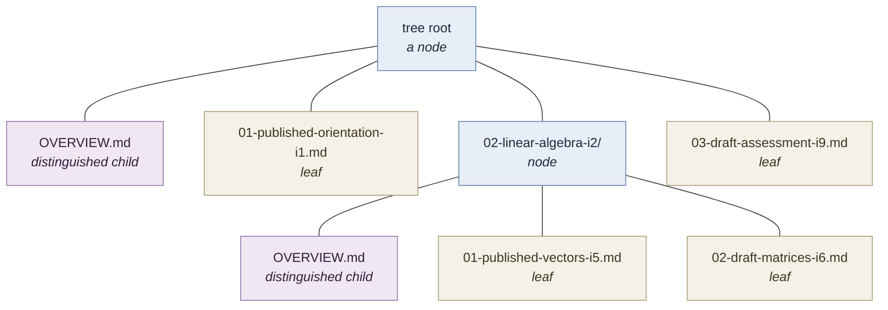
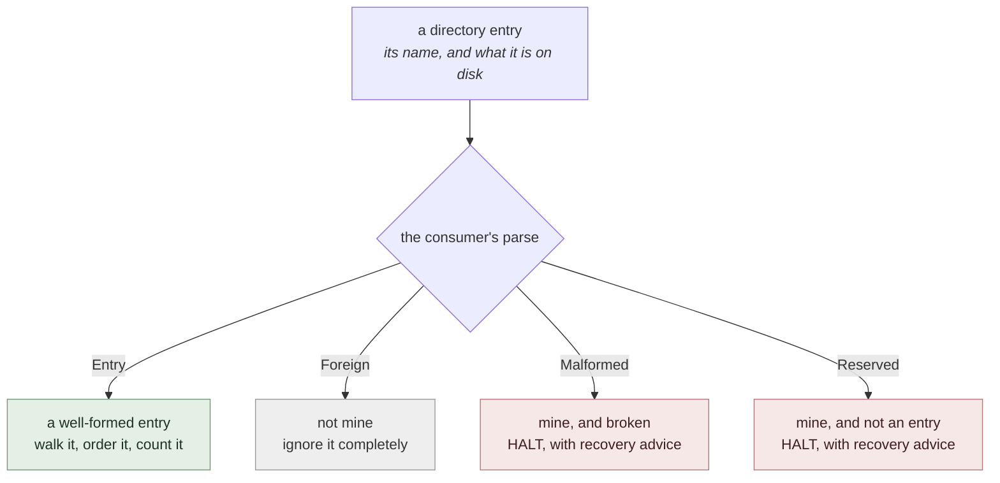
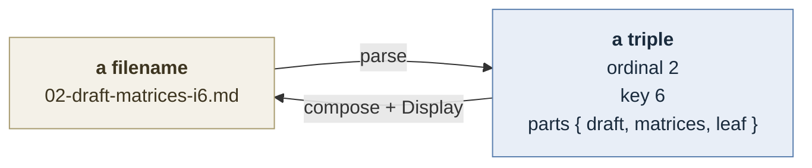
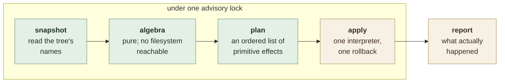

# ordinal-fs-tree

An ordered tree of entries stored as a directory tree, where each entry's
position, identity and metadata live in its **filename**. The filesystem carries
the hierarchy; the names carry everything else. There is no index, no database,
and no metadata file — a directory listing *is* the data structure.

That is the whole proposition: a tree you can read with `ls`, edit with `mv`,
diff in version control, and reason about without running the program that owns
it. The library's job is to make the operations that maintain such a tree
correct, and to make the properties it relies on checkable.

It owns the algebra — ordering, identity, traversal, and the mutations that
preserve both. It owns none of the vocabulary. What a name looks like, what
metadata it carries, and what any of it *means* are supplied by the consumer
through a single trait.

---

## The model

An **entry** is either a **leaf** — a regular file — or a **node** — a directory
holding children. A node may hold **zero or more** children; nothing requires a
node to be populated.

Every entry's name encodes four things:

| | | |
|---|---|---|
| **ordinal** | the entry's position among its siblings | mutable; the sole sort input within one level |
| **key** | the entry's identity | assigned once, unique across the whole tree, never rewritten |
| **label** | a human-facing name | not unique, not identity |
| **attributes** | whatever else the consumer needs | entirely opaque to the library |

A node may additionally hold one **distinguished child**: an entry that is the
node's *own content* rather than one of its children. It carries no ordinal and
no key, it never participates in ordering, and a node may have none. It is a
**regular file** — a walk does not descend into it, so a distinguished child
that were a directory would hide everything beneath it from every traversal.

The tree's **root** is a node that is **not an entry**. It is the directory the
consumer hands the library; it has no ordinal, no key and no parts, and its own
name is never parsed. It may hold a distinguished child like any other node.
The consequence shows up in the reading operations: whatever `ancestors`
returns, its element type cannot be the entry type, because the root is always
the last thing in the chain.



Throughout this document the examples use a course syllabus — modules and
lessons, each carrying a `draft`/`published` attribute — purely to have
something concrete to point at. None of it is known to the library. It is a real
implementation of the trait below, shared by every test in the crate and by the
crate's one binary so that the examples here and the fixtures cannot drift
apart; [`CLI.md`](CLI.md) is what that binary is.

### Why ordinal and key are separate

They answer different questions, and conflating them is the mistake this design
exists to avoid.

The **ordinal** answers *where does this sit among its siblings*. It is a
locator. Inserting an entry rewrites the ordinals of everything after it, so an
ordinal is only true until the next insert.

The **key** answers *which entry is this*. It survives insertion, reordering,
relabelling, and being moved between levels. It is the only thing safe to store
in a durable cross-reference.

Because the filesystem carries the hierarchy, an ordinal is **per-level** — it
locates an entry within one directory and says nothing about the path to it.
This is what makes insertion cheap: shifting siblings renames entries at one
level only, and each renamed node carries its entire subtree along untouched.

### Keys are the counter

A fresh key is `max(key over the whole tree) + 1`. The names *are* the counter —
there is no separate file recording the next value, because such a file would be
a second source of truth that a hand-edit could desynchronise.

The direct consequence is that **the library offers no removal operation.**
Deleting an entry lowers the visible maximum, so the next allocation re-issues a
key that other entries may still reference. A domain that genuinely needs
entries to disappear needs a key source that is not derived from the tree, and
that is outside what this library does. A domain that needs entries to be
*retired* should mark them through an attribute and leave them in place — which
costs nothing, since attributes are yours and the library never reads them.

---

## Names belong to the consumer

The library never parses a name, never formats one, and never learns that a name
is a string. It knows only that a name can be decomposed into an ordinal, a key
and an opaque remainder — and recomposed from them.

### The parse trichotomy

A directory in a real filesystem contains entries the consumer never wrote.
Classifying them is where tree libraries quietly lose data, so this is the one
place the library is opinionated: parsing yields **three** outcomes, not two.



The distinction that matters is between **Foreign** and **Malformed**. A
`README.md` sitting in the tree is foreign: skipping it is correct and costs
nothing. A name that is *almost* one of yours — a typo, a hand-edit, a mangled
attribute — is not foreign, and skipping it is data loss. When the skipped name
is a *directory*, an entire subtree vanishes from every traversal while the tree
still reports itself as healthy.

So the rule is: **a name the consumer recognises as its own must either parse
completely or halt the operation.** It may never be silently ignored. Only names
the consumer positively disclaims are skipped — and a disclaimer is recursive:
skipping a foreign *directory* skips everything beneath it, which is sound
precisely because the consumer said the name was not its own.

Classification takes the name **and what the listing says is under it**,
unfollowed. That second argument is not decoration. A name declaring a node over
a regular file is malformed by the same argument that makes a typo malformed —
it is another way a subtree vanishes — and the library can see the contradiction
but has no domain error value with which to report it. Handing `found` to
`parse` puts the judgement where the recovery advice already lives.

`Reserved` is the fourth outcome and the narrow one: a name the consumer owns
that is deliberately *not* an entry — a transaction witness, a lock marker, a
sentinel left by an interrupted operation. Its presence halts work the same way
a malformed name does, and for the same reason: the library cannot know what it
means, so proceeding past it is a guess.

Both halting outcomes carry the consumer's own error value, so refusal can say
what to *do* about it. Detection alone produces errors that are useless to
whoever hits them.

---

## The seam: one trait

All genericity lives in one trait. There are no callbacks, no hooks, no
registration, and no configuration objects.

```rust
// `Display` is the one rendering the library knows about, and it must yield
// exactly one filename — see the obligation below, the only one the library
// enforces rather than assumes.
pub trait EntryName: Sized + Clone + fmt::Display {
    /// Everything the library does not understand: the label, and whatever
    /// attributes the domain carries. Entirely opaque.
    type Parts: Clone + Eq;

    /// The domain's own error, so a refusal can carry recovery advice.
    type Err: std::error::Error + Send + Sync + 'static;

    /// Classify one directory entry: its name, and what the listing reports
    /// is under that name, unfollowed. See the parse trichotomy.
    fn parse(name: &str, found: Found) -> Verdict<Self, Self::Err>;

    /// Build a positioned name. The species follows from `parts`.
    fn compose(ordinal: Ordinal, key: Key, parts: Self::Parts) -> Self;

    /// The name a node's distinguished child takes, if this domain has one.
    /// A distinguished child carries neither an ordinal nor a key, so it can
    /// never be produced by `compose` — this is the only way the library can
    /// name one. `None` means the domain has no distinguished child, and
    /// promotion is refused rather than guessed at.
    fn distinguished() -> Option<Self> { None }

    /// What this name is: a positioned entry with its triple, or the
    /// distinguished child. One value, because it is one choice — see the
    /// obligation below.
    fn view(&self) -> NameView<'_, Self::Parts>;

    /// The species of a positioned name carrying these parts. No `self`, no
    /// ordinal, no key: the species follows from the parts and from nothing
    /// else. See the obligation below.
    fn positioned_species(parts: &Self::Parts) -> PositionedSpecies;
}

/// Blanket-implemented and sealed, so these are readings of the two methods
/// above rather than methods an implementation may supply.
pub trait EntryNameExt: EntryName {
    fn triple(&self) -> Option<Triple<'_, Self::Parts>>;
    fn species(&self) -> Species;

    /// Whether these two names are one name: the view *and* the species. What
    /// every occupancy check compares — see the species obligation below.
    fn same_name(&self, other: &Self) -> bool;
}

pub struct Triple<'a, P> { pub ordinal: Ordinal, pub key: Key, pub parts: &'a P }

pub enum NameView<'a, P> { Positioned(Triple<'a, P>), Distinguished }

pub enum Verdict<N, E> { Entry(N), Foreign, Malformed(E), Reserved(E) }
pub enum Species          { Leaf, Node, Distinguished }
pub enum PositionedSpecies { Leaf, Node }
pub enum Found            { File, Dir, Other }
```

### What an implementation must guarantee

Seven obligations. Six the library assumes and cannot check at run time; the
seventh it **enforces**, and the asymmetry has a reason worth stating rather
than leaving to be noticed. They are stated because the structural model found
that four were missing, and that a design missing any one of them admits a tree
the library will quietly corrupt. Two of the seven are discharged by the Rust
seam's *shape* rather than checked, and both are marked below.

**Compose places what it is given.** `compose(o, k, p)` yields a name whose
view is `Positioned` with `ordinal == o`, `key == k` and `parts == p`. Without
this the isomorphism below says nothing, and the sibling shift — which is
nothing but a `compose` — is free to move one entry's key onto another's
position while every stated invariant still holds.

**The grammar is canonical.** Distinct filenames never parse to the same name:
`format(parse(f)) == f`, and not merely `parse(format(n)) == n`. State one
direction only and a grammar may accept two spellings of one name — at which
point two files on disk *are* one entry, sharing a key and an ordinal, and the
tree carries a duplicate key that no invariant rules out.

**A name is positioned or distinguished, never neither.** *In Rust this one is
discharged by the type system, and it is stated because it is not free
everywhere.* Under three separate `Option` accessors beside an independent
`species()` — the shape this document carried while the structural model was
written — two states are admitted: a name of species `Leaf` with no ordinal, an
entry that cannot be ordered, shifted or promoted and that no triple names; and
a name carrying a triple while claiming species `Distinguished`. `NameView`
carries the triple *and* the positioned-or-distinguished choice in one value, so
neither can be written. `seam-k17` found the first version of this claim
overstated: one `Option` over the three fields closed the first state and left
the second, while the document, the model and the kit all said the obligation
was discharged. Discharging it takes the *view*, not the `Option`.

**The species follows from the parts.** *Discharged by the seam's shape too, and
by the signature rather than by a sum type:* `positioned_species` is an
associated function over a `&Parts`, so there is no `self`, no ordinal and no
key to consult. The structural model assumes this as `SpeciesFromParts`, and the
sibling shift is what rests on it — shifting is `compose(new_ordinal, key,
parts)`, so a species free to vary with the ordinal would let a shift turn a leaf
into a node, which on disk is a file renamed into a directory. `seam-k17` found
the trait exposing `fn species(&self)` independently, where an implementation
could do exactly that and pass every check the kit made.

What the signature discharges is that the species is **definable** from the
parts and from nothing else. It does not make the species a function of the
parts' *equivalence class*, and the difference is not academic. `Parts` is
bounded by `Eq`, which is any lawful equivalence — a domain may compare two
parts equal while `positioned_species` calls one a leaf and the other a node,
and it breaks no obligation by doing so. Both models assume the congruence for
free, because `structure.als` compares `Parts` atoms and `operations.qnt`
compares ints, and neither can pose an equality coarser than identity. So the
library does not conclude *same name* from *same view*: name identity is the
view **and** the species, which is `EntryNameExt::same_name`, and it is what
every occupancy check compares. `promote-k25` found this the expensive way —
before it, a domain of exactly that shape lost every valid promotion to a
`DestinationOccupied` refusal, since a promotion is the one operation whose new
name deliberately reuses the old one's ordinal and key. Requiring the congruence
of the domain instead was the alternative, and it was rejected because no sample
of parts can exercise it: the kit reports an obligation it cannot reach as
untested, so every well-behaved domain would have failed conformance to state a
property only a misbehaving one can demonstrate.

Both are `docs/formalism-findings.md` entry 002's own counterfactual applied to
the implementation: **before modelling a structural property, ask whether the
target language already forbids it.** The conformance kit checks the other five
obligations and names these two as discharged, so a reader counting five checks
against seven obligations can see that the other two were not forgotten.

**`distinguished()` names the only entry of its species.** `parse` yields
species `Distinguished` for that name and for nothing else. This is what makes
*at most one distinguished child per node* true — the filesystem supplies the
rest, since a directory cannot hold two entries of one name — so it is a
theorem rather than an invariant anything has to enforce.

**`parse` refuses what `found` contradicts.** A name declaring `Leaf` over a
directory, or `Node` over a regular file, is `Malformed` and never `Entry`. It is
`Malformed` specifically, and not merely *not an `Entry`*: `Foreign` means *not
my name*, and a walk skips a foreign name — and everything beneath it when it is
a directory — without saying so. A domain that answers `Foreign` where its own
name contradicts the listing has hidden exactly the subtree this obligation
exists to expose.

**A name renders as one path component.** `Display` yields exactly one
filename: not the empty string, not `.` or `..`, and never anything holding a
path separator. *This is the one obligation the library does not merely assume,
and the reason it is different in kind is what the rest of this paragraph is
for.* Break any of the other six and the library corrupts the tree it was
handed; break this one and it **leaves** the tree. The rendering is what gets
joined to a level's directory to reach an entry, so a name rendering as
`../outside`, as `child/../../outside`, or as an absolute path makes a create, a
rename, a rollback's removal and every reported path address outside the
directory whose lock is the only thing covering any of it — while the algebra,
which compares views and never renderings, sees a name that is perfectly
canonical. That is the central proposition of this library, *one directory tree
is the data structure*, made false by a value the algebra never looks at.

Neither model can pose it, in the same position as the three refusals below that
neither can reach: both hold no strings by design, exactly as they hold no bytes.
So there is no witness to point at, and the check is a boundary instead. The two
places a name becomes a path are the only two places it is needed: every name a
snapshot admits is checked when the tree is read, and every name a plan will
place is checked before any effect runs — so a plan carrying one changes nothing
rather than landing what it can and unwinding. A violation is a refusal carrying
the offending rendering and what is wrong with it. The conformance kit checks it
as well, because a test is a cheaper place to meet it than an operation, and
`tests/names_are_confined.rs` is the enforcement's own control: two adversarial
domains, one per boundary, each satisfying everything the algebra looks at.

### The isomorphism this rests on

A positioned entry's name is **isomorphic to a triple** — `(ordinal, key,
parts)` — and that single fact is what keeps the seam small. *Isomorphic* is
load-bearing, and it means both directions at once: `compose` recovers the name
from the triple, and the view recovers the triple from the name. An earlier
draft stated only the string round trip, which leaves a `compose` free to ignore
its arguments entirely — and the string round trip itself is about *names* and
not about spellings: a grammar that renders what it was given and reads that
same spelling back as a different triple has broken it while every filename on
disk looks right.



Everything follows from it:

- **Shifting a sibling is not an operation.** It is
  `compose(new_ordinal, key, parts)` — derived, not implemented, and therefore
  incapable of disturbing a key, a label or an attribute.
- **The library holds no strings.** The grammar is a boundary concern; the
  algebra works on triples. So do the formal models: their state contains no
  strings at all, and the entire grammar reduces to one round-trip law.
- **The species follows from the parts.** A consumer whose leaves and nodes
  carry different metadata expresses that as variants of `Parts`, and the
  library never needs to be told which it is looking at. It is stated as an
  obligation above because it is one: the derivation of the shift depends on it,
  and the seam is shaped so that a domain cannot break it.

### What is *not* in the trait, and why

Two things a reader might expect here are deliberately absent.

**Locking is invisible.** The library takes an advisory lock on the directory
*containing* the tree root — not the root itself. The containing directory
exists before the root is created and persists after it is deleted, so the tree's
creation and destruction fall under the same lock as every ordinary operation.
That reasoning is general, so it is the library's rule rather than a parameter.
Consumers never mention locking.

The lock names the **tree**, not a spelling of it: every accepted spelling of one
root — a relative path and an absolute one, a route through `..`, a symbolic link
naming the root — takes the same lock, or a writer through one spelling would not
exclude a reader through another and the intermediate states a mutation is
entitled to leave would be observable. Nothing is canonicalised to achieve that.
The library asks for the containing directory as `<root>/..` and the *kernel*
resolves it, so the identity `flock` attaches to follows the tree while every
path the library reports stays in the caller's own spelling. A lexical parent
does **not** have this property, and assuming it did was the defect
`reading-k19` found.

**Version control is not a concern.** Renaming an entry is `rename(2)`. The
library does not detect a repository, does not update an index, and does not
require any tool on `PATH`.

---

## How an operation runs

Every mutation follows the same four steps. Only the last touches the
filesystem.



This is internal structure, not interface — a consumer calls
`tree.insert(...)` and receives a report of what happened, never a plan to
apply. A mutation **consumes** the handle it is called on, and the lock is
released with it: every operation is planned from the snapshot, so a handle that
outlived its own mutation would plan the next one from a tree that no longer
exists — and refreshing the snapshot instead would mean a mutation that
succeeded returning the error of the read that followed it, which is exactly the
shape *plan atomicity* promises not to have. Reading first is unaffected, and a
caller wanting several entries at once has `append_many`. **Snapshot scope is internal too**: whole-tree today, and narrowing it
later would be an invisible refinement. It is load-bearing in one visible way,
which the *Refusals* section states — a name the consumer cannot parse halts
every mutation, wherever in the tree it sits.

Two other shapes were considered and rejected, and both are worth naming because
each is what a reader would otherwise reach for:

- **Pure functions over name lists** — the shape the code being replaced has. It
  leaves the shift-ordering rule inside filesystem code, where nothing can model
  it and nothing can test it. Everything the section below says about that
  ordering is only sayable because the plan is a value.
- **Read, transform, diff** — compute the desired tree and derive the effects.
  That makes the diff a second thing to get right, and the plan's order becomes
  an output of a diffing algorithm rather than a stated property.

The plan shape also gives every operation *one* rollback rather than each
hand-rolling its own, which is what stops them drifting apart.

But the split is what makes the library's claims checkable:

- **The algebra cannot reach the filesystem.** Every decision — which siblings
  move, in what order, what each is renamed to — is a pure function of the
  snapshot, so it is testable without a directory and modellable without an
  abstraction of one.
- **Atomicity is one property, not many.** A single interpreter claims each
  destination with an exclusive create and unwinds the effects it applied if a
  later one fails. Every operation inherits the same guarantee instead of
  hand-rolling its own, and they cannot drift apart.
- **The promise is bounded and stated.** Rollback covers *reported* errors.
  A process killed mid-apply is not recoverable, and the library says so rather
  than implying otherwise. It does not cover a rollback that *itself* fails —
  see *When rollback fails* below, which is the one case where the library can
  damage a tree it was handed.

### The plan is checked against itself, in order

The algebra decides whether a plan can run by folding it through the snapshot,
so it meets each destination in the state the interpreter will meet it. Checking
every destination against the *snapshot* instead — the obvious reading of "a
pure function of the snapshot" — is not merely stricter. It refuses correct
inserts, and it makes the ordering rule below buy nothing at all, because under
it the two orders are refused in exactly the same cases.

Sequencing the check is also what makes the interpreter's own exclusive create
unreachable in ordinary use: the algebra already knows what every effect will
find. What keeps that check in the code is that the lock is **advisory** — a
writer that does not take it can occupy a destination between the snapshot and
the apply. It guards against an uncooperative neighbour, not against the plan.

### Why the shift runs highest-first

A sibling shift renames highest-ordinal-first. The rule is real, but not for the
reason it first appears, and the difference is worth stating because it decides
what an *interrupted* operation leaves behind.

**Collision is not the usual reason.** A name embeds a tree-unique key, so two
siblings never want the same filename and no destination is occupied whatever
order the renames run in. The order matters for collision only on a tree that
already violates key uniqueness — two siblings sharing a key *and* its parts at
adjacent ordinals, which a hand edit can produce (`cp 01-foo-k5.md
02-foo-k5.md`) and the library never checks for. There, highest-first succeeds
and lowest-first is refused.

**The reason that applies to every tree is the intermediate state.**
Highest-first vacates each destination before it is needed, so ordinals stay
distinct at *every* step of the apply: an operation interrupted halfway leaves a
level that is merely **gapped**, which this design admits everywhere. Run the
other way, the same shift passes through a state with a **duplicate ordinal** —
which it does not. Since a process killed mid-apply is unrecoverable by the
paragraph above, the order is what decides which of those two a crash leaves.

That is a property of the plan, checkable by reading it, rather than an accident
of a loop's direction. It is also visible to the consumer: a report lists what
was created and what was renamed in each species' own order — so the
highest-first rule can be read off the renames — and lists every path it left
behind in **exactly the order the effects landed**, which for a mixed plan is
neither of those two. An `insert` is shifts then a create, and a promotion with
a first child is create, move, create; a report of two species-sorted buckets
could not state either.

---

## Operations

Every operation names its target **by key**. Nothing else would do: an ordinal
is stale the moment anything is inserted before it, and a path is stale the
moment anything is renamed. The key is the one handle the design already
promises survives, so it is the one the operations take.

The tree root takes a variant of its own, since it is not an entry and has no
key — but only where a target is a **level** something goes into. `promote` and
`rewrite` name an *entry* and take a bare key: the root is not an entry, so
there is nothing for the extra variant to mean, and offering it would be
offering a call refused by construction. The behavioural model splits them the
same way — `TagPromote` and `TagRewrite` carry a key where `TagInsert` carries a
target.

### Reading

| operation | behaviour |
|---|---|
| `walk` | Every entry in depth-first pre-order. Within a level: the distinguished child first, then children by ordinal. Nodes are descended in place, so a node at an earlier ordinal is fully explored before a later sibling. |
| `seek` | The first entry in `walk` order satisfying a predicate the caller supplies. Short-circuits. Answers a `sought`. |
| `by_key` | The entry with a given key, or nothing. Answers a `sought`. Keys are unique in any tree the library built; in one it did not, this returns the first in `walk` order and the caller has a tree to repair. |
| `ancestors` | An entry's containing nodes, root-first. The chain ends at the tree root, which is a node and not an entry, so its element type is not the entry type. |
| `distinguished_chain` | The distinguished child of each of an entry's ancestors, root-first, skipping levels that have none. |

A directory listing arrives in whatever order the filesystem chose, so walk
order is computed from the names and never from the order they were read in.
Within a level that is: the distinguished child, then ordinal, then — for a level
a hand edit has left carrying a **duplicate** ordinal, which every invariant here
only ever *preserves* — key, and then the rendered name, which is total because
one directory cannot hold two entries of one name. The tie-breaks are not
decoration: without a total order over a level, *the first in walk order* would
name a different entry on two machines holding byte-identical trees, and `by_key`
on a damaged tree would answer differently on each. None of this is checked by
either model — `operations.qnt` models reachability and resolves `by_key` by
least internal id, and says so — so it rests on this paragraph and on the tests
named for it.

#### A search that matched nothing has a word

Both searches above can match nothing, and neither answers `None`. They answer a
**sought**: `Match` or `Nothing`.

The library's other negative answer is a **refusal**, and every one of its
variants is a refusal to *mutate*. A search is not a mutation — nothing was asked
to change, so nothing can have been refused, and a tree holding no such key is
not a damaged tree either. A store whose only word for *matched nothing* is
`None` leaves that unsaid, and each consumer then invents its own word for the
same concept; one word here is one word everywhere.

The distinction is between a **search** and an **accessor**. A search takes a
criterion and scans a set for it, and `Nothing` is a fact about the scan. An
accessor reads an attribute off something already in hand — an entry's key, a
node's contents — and its absence is a fact about that entry, not about any
search; those keep the language's own optional. `Option` remains reachable from a
sought by an explicit conversion, because a consumer's control flow is its own,
but it appears in no signature this library owns.

Neither model has this distinction, and neither moved for it. A search adds no
state transition, and `operations.qnt` already resolves a key with `leastId`,
which answers `-1` when nothing matched — an in-band sentinel, and exactly the
shape a typed answer replaces. This is a Rust type-level statement of
something both models had to spell some other way.

There is no built-in notion of which entry is "next", "current" or "interesting",
and **no lookup by label**. Those are questions about the consumer's attributes,
and a predicate passed to `seek` answers them without the library ever learning
what it asked.

Label lookup is absent because it is not expressible, not because it was left
out. The trait names no label type, so a `by_label` has nothing to take as an
argument; the only value the caller could pass is a whole `Parts`, and `Parts`
equality answers *same label* only in a domain where the label alone determines
every attribute — which contradicts `Parts` being label *plus* attributes.
`by_key` is the one lookup the library can offer, because the key is in every
positioned name's view and a label is not.

### Mutating

| operation | behaviour |
|---|---|
| `append` | Add a child at the end of a node: the next free ordinal, a fresh key. |
| `append_many` | Add several children at consecutive ordinals with consecutive keys, planned from one snapshot and applied as a unit. Either the whole run lands or none of it does. |
| `insert` | Add a child at an occupied ordinal, shifting the occupant and every later sibling up by one. Each shift is one rename; a shifted node carries its whole subtree. |
| `promote` | Turn a leaf into a node, **with the node's parts supplied by the caller**. The leaf's content moves verbatim into the new node's distinguished child, keeping the same ordinal and the same key — the entity is unchanged, only its shape. Optionally creates a first child in the same unit, for consumers that want both atomically. It is the one operation whose intermediate state breaks an invariant; see below. |
| `rewrite` | Replace an entry's parts, keeping its ordinal, key and species. This is how an attribute changes: the entry keeps its identity and its place, and only the opaque remainder of its name moves. Parts implying a *different* species are refused — a file cannot be renamed into a directory. |

### Promotion is not atomic against the invariants

A promotion creates the node before it can move the leaf's content into it, and
the node carries the leaf's own ordinal and key — that is what identity
preservation means. So between its two effects **both are on disk**, sharing an
ordinal and a key. There is no ordering that avoids it: the library has no name
for a temporary, and a node with any other ordinal or key would not be the same
entry.

The consequence is that the invariants below hold of **quiescent** trees — trees
between operations — and not of every state the filesystem passes through. The
lock is what makes that distinction safe, since no cooperating reader observes
an intermediate state.

### When rollback fails

Rollback unwinds the effects a run applied, in reverse. If an unwind step itself
fails, the operation reports it and stops, and the tree is left in neither the
state it was found in nor the one intended.

On the promotion path that is worse than untidy: the single undo is *remove the
node just created*, so a rollback failing there leaves the leaf and the node
both in place, sharing an ordinal and a key. **This is the one path by which the
library creates a duplicate key in a tree it was handed** — everywhere else a
duplicate key is a defect the library inherits rather than causes. Recovery is
mechanical and worth stating to the consumer: a node and a leaf sharing an
ordinal and a key, with the node holding no distinguished child, is an
interrupted promotion, and either half can be removed to resolve it.

`rewrite` is the general form of every "mark this entry" operation a consumer
might want. Because attributes are opaque, the library neither knows nor cares
what changed — it verifies that the ordinal, key and species survived, and
renames.

`promote` takes the node's parts for a reason worth stating, because the first
draft did not and the structural model showed the operation could not be
written. Species follows from parts, so naming the promoted node needs parts
that imply `Node` — and the library cannot make one. `Parts` is opaque and its
bounds are `Clone + Eq`: the library can copy a `Parts` it already holds and
compare two of them, and that is all. Every `Parts` value it can reach comes
from a name already in the tree, and none of those describes *this* entry as a
node. So the parts come from the caller, who has the domain's own constructors,
exactly as they already do for `append` and `rewrite`. The alternative — a trait
method mapping a leaf's parts to a node's — would widen the seam to serve one
operation, and would force every domain to declare a canonical leaf-to-node
mapping when the honest one is often lossy.

### Refusals

Every mutation is total: each states what it does when its precondition fails,
and none is left undefined.

- A key naming no entry is refused. On a tree carrying a *duplicate* key the
  target is the first in `walk` order, with the same caveat `by_key` already
  carries — the operation succeeds and the tree still needs repairing.
- `append`, `append_many` and `insert` require their target to be a node. A
  designated leaf is refused: a leaf is a regular file and holds nothing.
- `insert` requires an existing occupant at the target ordinal. Inserting past
  the last sibling is `append`'s job and is refused rather than quietly
  redirected — the two differ in their effect on every later sibling, so
  guessing which was meant would be guessing at intent. The same refusal covers
  every **hole** at or below the level's greatest ordinal, where that rationale
  does not apply and no operation fills the hole: such an ordinal can be
  occupied only by hand. That is a consequence of density being preserved and
  never established, and it is stated here rather than left to be discovered.
  The refusal carries the **span** of ordinals the level occupies, least and
  greatest, so its message can separate the three and say only what it can
  prove: past the last sibling, a gap **between** two occupied ordinals, and a
  hole **below** the first occupied one — the last of which has no lower
  neighbour to name, since `Ordinal::FIRST` is not a floor on a hand-edited
  level. The greatest alone separates the first from the other two; naming a
  lower occupant needs the least.
- `promote` applies to a leaf, and a node is refused: it is already a node.
  A distinguished child would be refused too — it has no ordinal to carry
  across — but **it cannot be asked for**. An operation names its target by key,
  a distinguished child carries none, and so neither `by_key` nor the model's
  `idsWithKey` can answer with one. The refusal is stated over species, because
  the species is what the check reads; saying *both are refused* without saying
  that only one ever arrives describes a case no argument produces and no
  witness reaches. `promote-k12` found it while implementing the check, and
  `docs/formalism-findings.md` entry 014 carries it.
- `promote` is refused outright in a domain with no distinguished child
  (`distinguished()` is `None`), because the leaf's content would have nowhere
  to go and discarding it silently is not an option.
- `promote` is refused when the supplied parts do not imply species `Node` —
  the same check `rewrite` makes, with the opposite verdict.
- `rewrite` is refused when the new parts imply a different species.
- Every mutation is refused when its destination is occupied by anything at
  all, including a symbolic link. Occupancy is decided without following links,
  and an occupancy that *cannot* be determined is a refusal rather than an
  assumption. Occupancy excludes the object being *moved*, or a `rewrite` whose
  new parts equal the old — a rename onto itself — would refuse its own no-op.

  Two names are one name when their views and their **species** agree —
  `EntryNameExt::same_name`, and not a view comparison, for the reason the
  species obligation above gives. The same rule decides an entry already in the
  snapshot and a destination an earlier effect in this plan has already taken,
  so the two halves of an occupancy check cannot disagree about what one name
  is.

  Two things narrow this refusal, and neither weakens it. A **foreign** name can
  never occupy a destination: the grammar is canonical, so a filename that
  formats a producible name parses as `Entry`, and one the consumer disclaims
  cannot collide with one it composed. A symbolic link carrying an entry's name
  is **malformed**, not occupying — `parse` sees what the listing found, so it
  halts at the snapshot, before any destination is computed. What remains is a
  tree carrying a duplicated key, a tree damaged by a failed rollback, and a
  neighbour that ignores the advisory lock.

- **Bytes supplied for parts that make a node are refused.** `append`,
  `append_many` and `insert` each take an entry's parts and its bytes; a node is
  a directory and has nowhere to hold bytes, so supplying some is a refusal
  rather than a silent discard. It belongs to **every operation that creates an
  entry**, and not to a list of them: the reason is a property of nodes, so an
  operation exempt from it would be one that can put bytes in a directory.
  *Neither model can pose this*: content is unmodelled in both by design, so it
  is stated here in the same position as the non-valid-text refusal below — a
  case the library can see and no model can reach.

- **A tree whose greatest key, or a level whose greatest ordinal, is the
  greatest that value can be is refused.** Allocation is `max + 1`, and an
  integer in either model is unbounded while a key and an ordinal are 32 bits.
  Nothing the library builds can reach either — a hand-written name carrying an
  enormous key or ordinal can. Refused rather than wrapped, because a wrapped
  allocation re-issues a key that is still referenced, which is what the whole
  no-removal rule exists to prevent.

- **A name the domain renders as anything but one filename is refused**, and it
  is refused wherever it appears: at the read, so no snapshot holds one, and
  before a plan's first effect, so no mutation carrying one changes anything.
  This is the seventh obligation above, and the only one the library enforces —
  everywhere else a broken obligation corrupts the tree, and this one leaves it,
  because the rendering is what is joined to a level's directory. *Neither model
  can pose it*: both hold no strings by design, so this sits beside the
  content-for-a-node and non-valid-text refusals as a case the library can see
  and no model can reach. The refusal carries the offending rendering, what is
  wrong with it, and the kit that would have caught it before there was a tree.

- A filename that is not valid text is refused, and it halts exactly as
  `Malformed` does. `parse` takes a string, so there is no verdict to be had and
  no domain error to carry: the refusal is the library's own, and it carries its
  own recovery advice. It halts rather than being skipped because a name that
  cannot be *read* cannot be disclaimed either — one mangled byte in a real name
  produces exactly this, and skipping the directory spelling of it would take the
  subtree. The cost is that genuinely foreign junk with such a name freezes the
  tree too; that is the same blast radius the next refusal states, arriving by
  one more road. Neither model can pose the case, because both hold no strings by
  design.

- A tree root that is its own containing directory — a filesystem root, however
  spelled — is refused before the tree is read. The lock goes on the directory
  *containing* the root, and there is not one. The test is the filesystem's own
  identity rather than the shape of the path, so `/`, `/..` and a symbolic link
  naming `/` are refused alike.

- A name the consumer recognises and cannot parse halts every mutation, not only
  one touching its own level. Snapshot scope is the whole tree, so a single
  `Malformed` or `Reserved` name anywhere a walk reaches freezes the tree until
  a human resolves it. That blast radius is the point — the alternative is
  proceeding past a name whose meaning the library cannot know — but it is
  large, and a consumer should expect it rather than meet it.

---

## Invariants

Every one of these is a **preservation** property, not an establishment one. The
library never validates the tree it is handed, and a tree meant to be edited by
hand is routinely one it did not build — so each invariant reads *given a tree
that already satisfies this, every operation leaves it satisfied*. An earlier
draft said that of ordinal density alone, which implied the others were stronger
than they are; they are not, and the honest statement is the one above.

They also hold of **quiescent** trees — trees between operations — rather than
of every state the filesystem passes through. An operation is a sequence of
renames and creates, and two of them pass through a state that violates a
statement below: a promotion carries the leaf and its new node at once, and a
shift run in the wrong order would duplicate an ordinal. The lock is what makes
that safe, and what a crash exposes.

Each is tagged with the model that owns it: **[S]** for the structural model,
which asks whether a shape is well-formed, **[B]** for the behavioural one,
which asks whether an operation preserves it. The split is not decoration —
several of these cannot even be stated without a notion of *before* and *after*,
and those are exactly the ones a structural model cannot check.

**Key uniqueness.** *[S precondition, B preservation]* No key appears twice in a
tree, and no key is ever reissued. Allocation is `max + 1` over every name in
the tree, including entries a consumer considers finished — which is exactly why
they must not be deleted. Nothing checks the precondition: a hand-edited tree
with a repeated key satisfies everything the library can observe, and `by_key`
then has two answers where its type admits one. This is a defect in the tree, not
in the library, and the library's part is to not create one — with the single
exception of an interrupted promotion, above.

*Reissued* is about **allocation, not creation**, and the distinction is
load-bearing rather than pedantic. `promote` creates a new directory that
carries the promoted leaf's existing key, deliberately: the entity is unchanged
and only its shape moved. Read as *no newly created object carries a key seen
before*, the claim is simply false. Read as *no newly allocated key was ever
committed before*, it holds. A key a failed operation created and then rolled
back was never committed, so allocating it again is correct — the counter
appears to go backwards, and nothing was reissued.

**Ordinal distinctness — and density only by induction.** *[S]* Within one node,
no two children share an ordinal. Density — ordinals being exactly `1..n` — is
*preserved* by every operation but never *established*: `append` allocates
`max + 1`, so a level that already contains a gap keeps it forever, and the
library never renumbers a level it did not just modify.

The distinction matters because this tree is meant to be edited by hand. A tree
the library built from empty is dense; a tree someone reordered with `mv` may
not be, and the library will neither notice nor repair it. **Distinctness is the
property to rely on.** Anything stronger holds only for trees nothing else has
touched, which is not a class the library can recognise.

**Distinguished children are regular files.** *[S]* A walk does not descend into
a distinguished child, so one that were a directory would hide an entire subtree
from every traversal while the tree reported itself healthy — the same failure
the Foreign/Malformed distinction exists to prevent, arriving by another road.
`parse` refuses it, since `parse` sees what is on disk.

**Subtree preservation under shift.** *[B]* An `insert` changes the ordinals of
siblings at or after the target and *nothing else*. Every key, every label,
every attribute and every descendant of every shifted entry is bit-identical
afterwards. A shifted node is one directory rename; nothing inside it is
touched.

Half of that is checked and half is assumed, and the halves are worth telling
apart. That the *plan* names no descendant — one rename per shifted sibling and
one create, and nothing else — is a property of the algebra and is checked. That
one rename carries a whole subtree is a property of `rename(2)`, below the
abstraction boundary the models stop at, and is assumed.

**Identity preservation under promotion.** *[B]* A promoted leaf keeps its ordinal and
its key. The entry that was a leaf *is* the node — not a new entry that replaced
it — so every reference to it by key still resolves.

That sentence is about the **entity**, not the file. The node is a new
directory, and the leaf's own file survives inside it as the distinguished
child: the content keeps its identity, the container acquires a new one. A
consumer holding a path is stale either way; one holding a key is not, which is
the whole reason the key exists.

**No recognised name is silently skipped.** *[S]* Every name in a traversed directory
is classified. Names the consumer disclaims are ignored; names it recognises
either parse completely or halt the operation. There is no fourth behaviour, and
in particular there is no path by which an unparseable directory disappears from
a traversal along with everything beneath it.

**Species agreement.** *[S, discharged at the boundary]* A name declaring a leaf
is a regular file; a name declaring a node is a directory. A name whose on-disk
species contradicts what it declares is malformed, not foreign — the same
reasoning as above, since this is the other way a subtree can vanish. It holds of
every tree the library will walk because `parse` receives `found` and refuses the
contradiction; stated without that, it is an invariant no component is positioned
to enforce, since the library can see the mismatch and cannot construct the
domain error that reporting it requires.

**The trait's obligations.** *[S]* The five laws under *What an implementation
must guarantee* — compose placing what it is given, a canonical grammar, names
positioned-or-distinguished, a single distinguished name, and `parse` refusing
what `found` contradicts. These are the consumer's, not the library's, and they
are everything the library assumes about the grammar.

Two properties are deliberately **not** in this list, because nothing has to
enforce them. *At most one distinguished child per node* follows from a single
distinguished name plus a directory not holding two entries of one name. *The
parse verdict is total and disjoint* follows from `Verdict` being a sum type.
Both were checked; both are free, and a model that restates them is testing the
compiler.

**Plan atomicity.** *[B]* After a mutation returns an error, either every effect
landed or none did. Rollback removes only entries the run itself created, so it
cannot destroy something that was already there. This covers reported errors and
not process death — nor a rollback that itself fails, which is the exception
*When rollback fails* states and the only way the library damages a tree.

---

## The models

The claims above are checked, not reviewed. The models live beside this document
and move with the crate when it is extracted.

| | |
|---|---|
| `models/structure.als` | Alloy. Whether the shape is coherent: what a well-formed tree is, what the trait can name, and which of the invariants above hold of a single tree. |
| `models/operations.qnt` | Quint. Whether each operation preserves that shape from any reachable state, and what it leaves when it is interrupted. |
| `models/run-alloy.sh` | Runs every Alloy command and reports pass/fail. |
| `models/run-quint.sh` | Runs every Quint claim, per instance, and reports pass/fail. |

The file is written so that nothing this document merely *claims* is an Alloy
`fact`. Claims are named predicates, and every command says which it assumes —
which lets one file carry both the design and the reasons for it:

- a **`check`** must find no counterexample. These are the properties above.
- a **`run witness_…`** must find an instance. Each one exhibits either a defect
  this document had before the model was written — reproducible on demand, so a
  later reader can see why a law is there by watching what happens without it —
  or a structure the design deliberately admits, such as a gapped level or a
  hand-edited tree with a duplicate key.

Two of the witnesses guard against the failure mode of the style: a `check` of
the form *laws imply property* passes for no reason if the laws are
unsatisfiable, so each bundle is shown to admit a populated tree at the scope its
checks run under.

Whether each operation preserves what it should, from any reachable state, is a
question about *before* and *after* that the Alloy model cannot pose. It belongs
to the behavioural model, and the **[B]** tags above were its worklist.

### What the behavioural model adds

`operations.qnt` keeps the same discipline in a different shape. Its state is a
tree and an operation in flight; its transitions are the plan interpreter,
applying one effect at a time and able to fail at any of them, so **every
intermediate state is a state the invariants are evaluated at**. That is what
lets it say things about interruption at all.

- an **`inv_…`** must hold in every reachable state of the instance that claims
  it. These are the properties above.
- a **`wit_…`** must be *reached*. Each one exhibits a refusal that has to be
  live, or a state the design admits, or a defect this document had before the
  model was written. A witness reached in **no** traces is a finding in its own
  right: that case is dead.

Refusals are **transitions, not disabled actions** — an operation is enabled for
every argument and returns an outcome — because a refusal is something the real
API does, and a refusal modelled as an impossibility can never be shown to be
either reachable or dead. Totality is then structural: the algebra returns a
decision for every state and every argument, and an unmodelled case would have
to be a missing branch the typechecker rejects.

The instances are the model's variables. Each fixes one question, and a property
that holds in one and fails in another is the point rather than a
contradiction — so a deliberately admitted violation is written as the witness
that *reaches* it, never as an invariant expected to fail.

| instance | the question it settles |
|---|---|
| `pristine` | Only the library writes. Every reachable tree is one it built, so **density holds** — the `init = empty tree` answer. |
| `hand_edited` | A human edits between operations. **Density fails**, everything else holds — the `init = arbitrary well-formed tree` answer, and the difference between these two instances is the whole of it. |
| `corrupted` | A hand edit duplicates a key, which the library admits and never checks. Even here, highest-first neither collides nor transiently duplicates an ordinal. |
| `lowest_first` | The same trees, shifted the other way. Both payoffs of the ordering rule are reached here and nowhere else. |
| `no_distinguished` | A domain where `distinguished()` is `None`, so promotion is refused rather than guessed at. |
| `unparseable` | A name the consumer recognises and cannot parse, and the whole-tree halt it causes. |
| `failures` | Effects fail. Where atomicity and rollback are checked. |
| `rollback_fails` | Rollback itself fails. The only instance that does not claim key uniqueness at rest, because this is what breaks it. |

Four things the behavioural model does **not** reach, recorded here rather than
left to be assumed: the filesystem beneath the interpreter (a rename carrying
its subtree is an assumption), walk *order* (reachability is modelled, the
ordering is not, so `by_key`'s tie-break on a duplicate-key tree is unchecked),
concurrent hand edits *during* an apply — which is exactly the case the
interpreter's own occupancy check exists for — and **parts equality**, which is
`int` equality here and `Parts` atom identity in the structural model. Neither
model can pose the coarser equality Rust's `Eq` admits, so *equal parts imply
equal species* is true in both by construction and assumed in neither; it is
`promote-k25`'s finding, and the library compares the species itself rather than
relying on it.

---

## What this library deliberately does not do

- **No removal.** Explained above: allocation is derived from the names, so
  deletion re-issues live keys.
- **No content model.** Bytes given to `append` are written verbatim; bytes moved
  by `promote` are moved verbatim. Templates, headers and formats are the
  consumer's.
- **No format migration.** Changing a name grammar is a consumer concern, and a
  library that offered to rewrite names it does not understand would be
  offering to guess.
- **No version control integration.** A rename is a rename.
- **No schema validation.** The trait defines what a name must yield, not what it
  must contain. A consumer that wants stricter names enforces that in its own
  `parse`.
- **No CLI.** The crate ships a binary, and it drives the reference domain
  rather than any conforming tree. A command factory generic over the name type
  would need a `Parts` out of argv, and the only route the seam offers — parse a
  whole filename and read its view — discards the ordinal and the key the library
  is about to allocate; giving it typed arguments instead means a second point at
  which the library is parameterised by its consumer, which is the thing
  [`docs/adr/entry-name-is-the-only-seam.md`](../adr/entry-name-is-the-only-seam.md)
  rules out. [`CLI.md`](CLI.md) carries the argument and the binary's own
  contract.

- **Unix only, for now.** The advisory lock is taken on a directory descriptor,
  which Windows has no equivalent for. Because locking is invisible in the
  interface, adding another platform later changes no signature and no caller.
