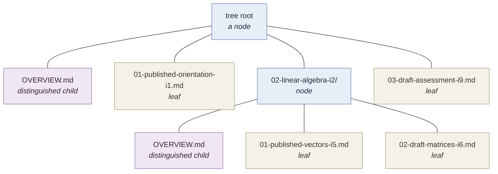
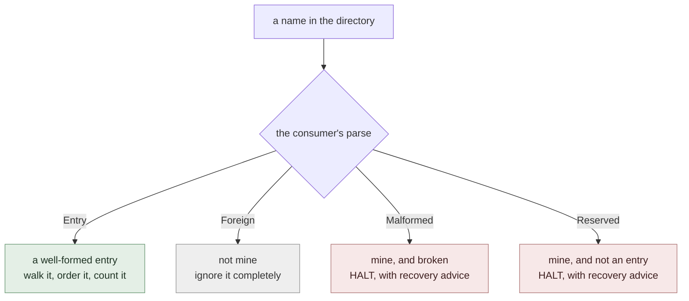
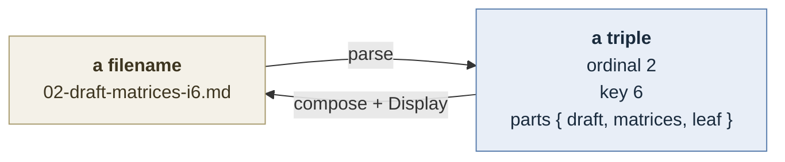
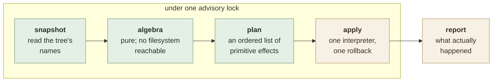

# ordinal-fs-tree

An ordered tree of entries stored as a directory tree, where each entry's
position, identity and metadata live in its **filename**. The filesystem carries
the hierarchy; the names carry everything else. There is no index, no database,
and no metadata file — a directory listing *is* the data structure.

That is the whole proposition: a tree you can read with `ls`, edit with `mv`,
diff in version control, and reason about without running the program that owns
it. The library's job is to make the operations that maintain such a tree
correct, and to make the properties it relies on checkable.

It owns the algebra — ordering, identity, traversal, and the mutations that
preserve both. It owns none of the vocabulary. What a name looks like, what
metadata it carries, and what any of it *means* are supplied by the consumer
through a single trait.

---

## The model

An **entry** is either a **leaf** — a regular file — or a **node** — a directory
holding children. A node may hold **zero or more** children; nothing requires a
node to be populated.

Every entry's name encodes four things:

| | | |
|---|---|---|
| **ordinal** | the entry's position among its siblings | mutable; the sole sort input within one level |
| **key** | the entry's identity | assigned once, unique across the whole tree, never rewritten |
| **label** | a human-facing name | not unique, not identity |
| **attributes** | whatever else the consumer needs | entirely opaque to the library |

A node may additionally hold one **distinguished child**: an entry that is the
node's *own content* rather than one of its children. It carries no ordinal and
no key, it never participates in ordering, and a node may have none.



Throughout this document the examples use a course syllabus — modules and
lessons, each carrying a `draft`/`published` attribute — purely to have
something concrete to point at. None of it is known to the library.

### Why ordinal and key are separate

They answer different questions, and conflating them is the mistake this design
exists to avoid.

The **ordinal** answers *where does this sit among its siblings*. It is a
locator. Inserting an entry rewrites the ordinals of everything after it, so an
ordinal is only true until the next insert.

The **key** answers *which entry is this*. It survives insertion, reordering,
relabelling, and being moved between levels. It is the only thing safe to store
in a durable cross-reference.

Because the filesystem carries the hierarchy, an ordinal is **per-level** — it
locates an entry within one directory and says nothing about the path to it.
This is what makes insertion cheap: shifting siblings renames entries at one
level only, and each renamed node carries its entire subtree along untouched.

### Keys are the counter

A fresh key is `max(key over the whole tree) + 1`. The names *are* the counter —
there is no separate file recording the next value, because such a file would be
a second source of truth that a hand-edit could desynchronise.

The direct consequence is that **the library offers no removal operation.**
Deleting an entry lowers the visible maximum, so the next allocation re-issues a
key that other entries may still reference. A domain that genuinely needs
entries to disappear needs a key source that is not derived from the tree, and
that is outside what this library does. A domain that needs entries to be
*retired* should mark them through an attribute and leave them in place — which
costs nothing, since attributes are yours and the library never reads them.

---

## Names belong to the consumer

The library never parses a name, never formats one, and never learns that a name
is a string. It knows only that a name can be decomposed into an ordinal, a key
and an opaque remainder — and recomposed from them.

### The parse trichotomy

A directory in a real filesystem contains entries the consumer never wrote.
Classifying them is where tree libraries quietly lose data, so this is the one
place the library is opinionated: parsing yields **three** outcomes, not two.



The distinction that matters is between **Foreign** and **Malformed**. A
`README.md` sitting in the tree is foreign: skipping it is correct and costs
nothing. A name that is *almost* one of yours — a typo, a hand-edit, a mangled
attribute — is not foreign, and skipping it is data loss. When the skipped name
is a *directory*, an entire subtree vanishes from every traversal while the tree
still reports itself as healthy.

So the rule is: **a name the consumer recognises as its own must either parse
completely or halt the operation.** It may never be silently ignored. Only names
the consumer positively disclaims are skipped.

`Reserved` is the fourth outcome and the narrow one: a name the consumer owns
that is deliberately *not* an entry — a transaction witness, a lock marker, a
sentinel left by an interrupted operation. Its presence halts work the same way
a malformed name does, and for the same reason: the library cannot know what it
means, so proceeding past it is a guess.

Both halting outcomes carry the consumer's own error value, so refusal can say
what to *do* about it. Detection alone produces errors that are useless to
whoever hits them.

---

## The seam: one trait

All genericity lives in one trait. There are no callbacks, no hooks, no
registration, and no configuration objects.

```rust
pub trait EntryName: Sized + Clone + fmt::Display {
    /// Everything the library does not understand: the label, and whatever
    /// attributes the domain carries. Entirely opaque.
    type Parts: Clone + Eq;

    /// The domain's own error, so a refusal can carry recovery advice.
    type Err: std::error::Error + Send + Sync + 'static;

    /// Classify a bare filename. See the parse trichotomy.
    fn parse(name: &str) -> Verdict<Self, Self::Err>;

    /// Build a name from its parts. The species follows from `parts`.
    fn compose(ordinal: Ordinal, key: Key, parts: Self::Parts) -> Self;

    /// The name a node's distinguished child takes, if this domain has one.
    /// A distinguished child carries neither an ordinal nor a key, so it can
    /// never be produced by `compose` — this is the only way the library can
    /// name one. `None` means the domain has no distinguished child, and
    /// promotion is refused rather than guessed at.
    fn distinguished() -> Option<Self> { None }

    fn ordinal(&self) -> Option<Ordinal>;
    fn key(&self)     -> Option<Key>;
    fn parts(&self)   -> Option<&Self::Parts>;
    fn species(&self) -> Species;
}

pub enum Verdict<N, E> { Entry(N), Foreign, Malformed(E), Reserved(E) }
pub enum Species { Leaf, Node, Distinguished }
```

### The isomorphism this rests on

A positioned entry's name is **isomorphic to a triple** — `(ordinal, key,
parts)` — and that single fact is what keeps the seam small.



Everything follows from it:

- **Shifting a sibling is not an operation.** It is
  `compose(new_ordinal, key, parts)` — derived, not implemented, and therefore
  incapable of disturbing a key, a label or an attribute.
- **The library holds no strings.** The grammar is a boundary concern; the
  algebra works on triples. So do the formal models: their state contains no
  strings at all, and the entire grammar reduces to one round-trip law.
- **The species follows from the parts.** A consumer whose leaves and nodes
  carry different metadata expresses that as variants of `Parts`, and the
  library never needs to be told which it is looking at.

### What is *not* in the trait, and why

Two things a reader might expect here are deliberately absent.

**Locking is invisible.** The library takes an advisory lock on the directory
*containing* the tree root — not the root itself. The containing directory
exists before the root is created and persists after it is deleted, so the tree's
creation and destruction fall under the same lock as every ordinary operation.
That reasoning is general, so it is the library's rule rather than a parameter.
Consumers never mention locking.

**Version control is not a concern.** Renaming an entry is `rename(2)`. The
library does not detect a repository, does not update an index, and does not
require any tool on `PATH`.

---

## How an operation runs

Every mutation follows the same four steps. Only the last touches the
filesystem.



This is internal structure, not interface — a consumer calls
`tree.insert(...)` and receives a report. But the split is what makes the
library's claims checkable:

- **The algebra cannot reach the filesystem.** Every decision — which siblings
  move, in what order, what each is renamed to — is a pure function of the
  snapshot, so it is testable without a directory and modellable without an
  abstraction of one.
- **Atomicity is one property, not many.** A single interpreter claims each
  destination with an exclusive create and unwinds the effects it applied if a
  later one fails. Every operation inherits the same guarantee instead of
  hand-rolling its own, and they cannot drift apart.
- **The promise is bounded and stated.** Rollback covers *reported* errors.
  A process killed mid-apply is not recoverable, and the library says so rather
  than implying otherwise.

Ordering within a plan is load-bearing. A sibling shift renames
highest-ordinal-first, so every destination is vacated before it is needed —
which is a property of the plan, checkable by reading it, rather than an
accident of a loop's direction.

---

## Operations

### Reading

| operation | behaviour |
|---|---|
| `walk` | Every entry in depth-first pre-order. Within a level: the distinguished child first, then children by ordinal. Nodes are descended in place, so a node at an earlier ordinal is fully explored before a later sibling. |
| `find` | The first entry in `walk` order satisfying a predicate the caller supplies. Short-circuits. |
| `by_key` | The entry with a given key, or nothing. Keys are unique tree-wide, so this never returns more than one. |
| `by_label` | Every entry with a given label. Labels are not identity, so this returns a collection and the caller disambiguates. |
| `ancestors` | An entry's containing nodes, root-first. |
| `distinguished_chain` | The distinguished child of each of an entry's ancestors, root-first, skipping levels that have none. |

There is no built-in notion of which entry is "next", "current" or "interesting".
Those are questions about the consumer's attributes, and a predicate passed to
`find` answers them without the library ever learning what it asked.

### Mutating

| operation | behaviour |
|---|---|
| `append` | Add a child at the end of a node: the next free ordinal, a fresh key. |
| `append_many` | Add several children at consecutive ordinals with consecutive keys, planned from one snapshot and applied as a unit. Either the whole run lands or none of it does. |
| `insert` | Add a child at an occupied ordinal, shifting the occupant and every later sibling up by one. Each shift is one rename; a shifted node carries its whole subtree. |
| `promote` | Turn a leaf into a node. The leaf's content moves verbatim into the new node's distinguished child, keeping the same ordinal and the same key — the entity is unchanged, only its shape. Optionally creates a first child in the same unit, for consumers that want both atomically. |
| `rewrite` | Replace an entry's parts, keeping its ordinal, key and species. This is how an attribute changes: the entry keeps its identity and its place, and only the opaque remainder of its name moves. Parts implying a *different* species are refused — a file cannot be renamed into a directory. |

`rewrite` is the general form of every "mark this entry" operation a consumer
might want. Because attributes are opaque, the library neither knows nor cares
what changed — it verifies that the ordinal, key and species survived, and
renames.

### Refusals

Every mutation is total: each states what it does when its precondition fails,
and none is left undefined.

- `insert` requires an existing occupant at the target ordinal. Inserting past
  the last sibling is `append`'s job and is refused rather than quietly
  redirected — the two differ in their effect on every later sibling, so
  guessing which was meant would be guessing at intent.
- `promote` applies to a leaf. A node is already a node, and a distinguished
  child has no ordinal to carry across; both are refused.
- `promote` is refused outright in a domain with no distinguished child
  (`distinguished()` is `None`), because the leaf's content would have nowhere
  to go and discarding it silently is not an option.
- `rewrite` is refused when the new parts imply a different species.
- Every mutation is refused when its destination is occupied by anything at
  all, including a symbolic link. Occupancy is decided without following links,
  and an occupancy that *cannot* be determined is a refusal rather than an
  assumption.

---

## Invariants

These hold over any tree the library produced, and are what the formal models
state and check.

**Key uniqueness.** No key appears twice in a tree, and no key is ever reissued.
Allocation is `max + 1` over every name in the tree, including entries a
consumer considers finished — which is exactly why they must not be deleted.

**Ordinal distinctness — and density only by induction.** Within one node, no
two children share an ordinal. Density — ordinals being exactly `1..n` — is
*preserved* by every operation but never *established*: `append` allocates
`max + 1`, so a level that already contains a gap keeps it forever, and the
library never renumbers a level it did not just modify.

The distinction matters because this tree is meant to be edited by hand. A tree
the library built from empty is dense; a tree someone reordered with `mv` may
not be, and the library will neither notice nor repair it. **Distinctness is the
property to rely on.** Anything stronger holds only for trees nothing else has
touched, which is not a class the library can recognise.

**Subtree preservation under shift.** An `insert` changes the ordinals of
siblings at or after the target and *nothing else*. Every key, every label,
every attribute and every descendant of every shifted entry is bit-identical
afterwards. A shifted node is one directory rename; nothing inside it is
touched.

**Identity preservation under promotion.** A promoted leaf keeps its ordinal and
its key. The entry that was a leaf *is* the node — not a new entry that replaced
it — so every reference to it by key still resolves.

**No recognised name is silently skipped.** Every name in a traversed directory
is classified. Names the consumer disclaims are ignored; names it recognises
either parse completely or halt the operation. There is no fourth behaviour, and
in particular there is no path by which an unparseable directory disappears from
a traversal along with everything beneath it.

**Species agreement.** A name declaring a leaf is a regular file; a name
declaring a node is a directory. A name whose on-disk species contradicts what it
declares is malformed, not foreign — the same reasoning as above, since this is
the other way a subtree can vanish.

**Name round-trip.** For every entry name the consumer can produce,
`parse(format(n))` yields that same name. This is the consumer's obligation, not
the library's, and it is the only thing the library assumes about the grammar.

**Plan atomicity.** After a mutation returns an error, either every effect
landed or none did. Rollback removes only entries the run itself created, so it
cannot destroy something that was already there. This covers reported errors and
not process death.

---

## What this library deliberately does not do

- **No removal.** Explained above: allocation is derived from the names, so
  deletion re-issues live keys.
- **No content model.** Bytes given to `append` are written verbatim; bytes moved
  by `promote` are moved verbatim. Templates, headers and formats are the
  consumer's.
- **No format migration.** Changing a name grammar is a consumer concern, and a
  library that offered to rewrite names it does not understand would be
  offering to guess.
- **No version control integration.** A rename is a rename.
- **No schema validation.** The trait defines what a name must yield, not what it
  must contain. A consumer that wants stricter names enforces that in its own
  `parse`.
- **Unix only, for now.** The advisory lock is taken on a directory descriptor,
  which Windows has no equivalent for. Because locking is invisible in the
  interface, adding another platform later changes no signature and no caller.
