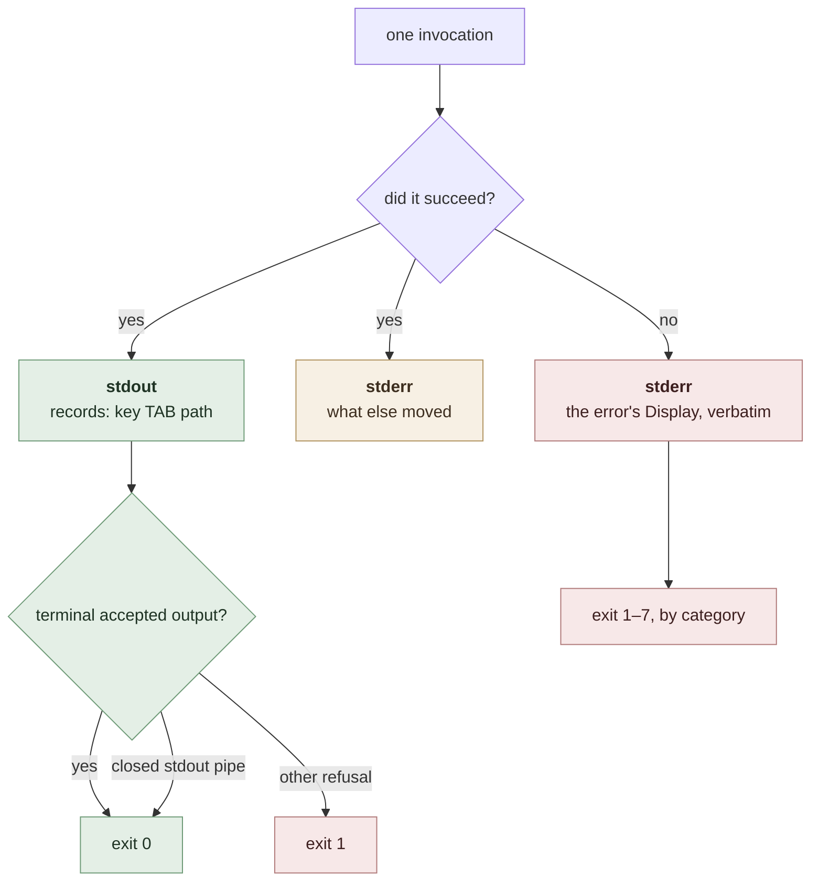

# The syllabus CLI

`ordinal-fs-tree` ships one binary, `syllabus`, which drives a course syllabus —
the reference domain [`ARCHITECTURE.md`](ARCHITECTURE.md) uses for every one of
its examples — from a terminal. It is the library's first end-to-end consumer and
its worked example of what a consumer looks like, and it is a **demonstration
rather than a product surface**: nothing is published, and grove's own CLI in
increment 2 is built from the library directly rather than from anything here.

This document is what `cli-k16` builds from. It is deliberately *not* a section of
[`ARCHITECTURE.md`](ARCHITECTURE.md): that document is the library's
specification of record and its claims are the ones the two models check, while
nothing below is modelled at all. Both move with the crate if it is extracted.

---

## What the CLI is, and what it is not

The root brief asks for two things that pull apart: *a CLI in `grove-llm`'s
shape*, and *a CLI that drives any conforming tree*. They conflict at exactly one
point, and the point is not a matter of taste.

**Argv is strings, and `Parts` is opaque.** Every mutating operation needs an
`N::Parts` from the operator, and `Parts` is bounded by `Clone + Eq` — the
library can copy one it already holds and compare two of them, and that is all.
So a generic CLI has one route to a `Parts`: hand the whole intended filename to
`EntryName::parse` and read the parts off the resulting name's `view()`. That
route is real and needs no widening of the seam, and it produces a bad CLI:

- The ordinal and the key in that filename are **allocated by the library and
  discarded**, so every mutating verb takes an argument two thirds of which is a
  lie. On `insert`, where the operator *does* choose the ordinal, the same
  argument would carry a second ordinal that is ignored.
- `parse` also takes `found`, so the CLI must declare the species it is about to
  ask for, or try both and take the unique `Entry` — sound for a conforming
  domain, and one more thing to explain.
- The help text can carry **no example**, because the library does not know what
  a name looks like. `cli-tool-design`'s second item is examples, and a generic
  factory is structurally incapable of one.

The alternative that produces good arguments is a command factory parameterised
by a parts-parser — `A: clap::Args + Into<N::Parts>` beside `N: EntryName`. That
is **a second point at which the library is parameterised by its consumer**, and
it falsifies the first sentence of
[`docs/adr/entry-name-is-the-only-seam.md`](../adr/entry-name-is-the-only-seam.md).

Both are rejected, and the decisive evidence is neither of the above. **The one
consumer we know is coming would use neither.** grove's verbs are `leaf-add`,
`leaf-retire`, `brief-chain` — named for what an operator wants, not for what the
algebra offers — so a factory handing out `append` and `insert` serves consumers
who want the algebra's verb set verbatim, and there are none. What it would cost
in exchange is a public `clap` in a crate whose manifest already argues, at
length, that every dependency it takes it imposes on grove and on every later
consumer.

So the reconciliation is: **the library drives any conforming tree; the CLI
drives the reference tree and shows a consumer how.** Reversing it later is
additive — a `cli` module could appear beside the binary without breaking a
consumer, changing an on-disk format or moving a model claim — which is exactly
why this decision is written here and not as an ADR: it clears
`ADR-FORMAT.md`'s surprising and trade-off clauses and fails its
hard-to-reverse one.

**The binary is named for the tree it drives, not for the library.** A binary
called `ordinal-fs-tree` would advertise a generic tool and be a third statement
of the thing this section rejects.

---

## Where it lives

One crate, as the root brief settled. Inside it:

| | |
|---|---|
| source | `bin/syllabus.rs` — **outside `src/`**, see below |
| manifest | `[[bin]] name = "syllabus", path = "bin/syllabus.rs", required-features = ["cli"]` |
| features | `default = ["cli"]`, `cli = ["dep:clap"]`, with `clap` optional |
| tests | `tests/driving_a_tree.rs`, contract tests over the binary through `assert_cmd` |

**The source is outside `src/` because of the no-filesystem guard, and this was
measured rather than assumed.** `tests/algebra_has_no_filesystem.rs` lexes every
`.rs` under `src/` outside `src/fs/` and refuses the identifier `fs`; a CLI must
call `ordinal_fs_tree::fs::read`, which is that identifier. A probe planted at
`src/bin/probe_tmp.rs` failed `the_algebra_cannot_reach_the_filesystem`, naming
its own line, and the same file moved out of `src/` passed. The alternative is a
second exemption in the guard, and the guard's own header says why that is the
wrong direction: *a new module is inside the algebra by default, which is the
direction that fails safe.* Keeping the CLI out of `src/` also says structurally
what the section above says in prose — **the CLI is not a module of this
library**, it is a consumer that shares a package with it.

**The feature is on by default, and that is the load-bearing half.** With
`default = []` the binary would not be built by a plain `cargo test`, so its
contract tests would be silently absent from the command `crate-k7`'s *Done when*
actually names — the failure mode this workstream has already paid for three
times over (`docs/formalism-findings.md` entry 003: a suite that did not run
reports what a suite that found nothing reports). What the feature buys instead
is an external consumer's escape: `default-features = false` gives the bare
library with `libc` and nothing else, and increment 2's grove dependency line is
where that is exercised. Inside this workspace the feature is unified on, which
costs grove nothing — it already locks `clap`.

The test file carries `#![cfg(feature = "cli")]` so that `--no-default-features`
does not leave `env!("CARGO_BIN_EXE_syllabus")` unresolvable.

---

## Naming a target

Every verb that names an existing entry names it **by key**, because that is the
one handle the design promises survives insertion, reordering, relabelling and
being moved between levels. Two spellings, and no third:

- `<key>` — a bare decimal, the number a name carries after `i`.
- `.` — the tree root, and **only** as the `<parent>` of the four `add` and
  `insert` verbs, whose target is a *level* something goes into. Every other verb
  takes a key alone: their target is an **entry**, the root is not one, and
  offering `.` would be offering a call refused by construction. That is the
  library's own `Target`/`Key` split, which the behavioural model makes the same
  way — `TagInsert` carries a target where `TagPromote` and `TagRewrite` carry a
  bare key.

`--root <path>` (default `.`) is the tree root, global, and **nothing
canonicalises it**. Every path the CLI prints is built from this spelling
verbatim, which is the library's own property made visible: `--root syllabus`
reports `syllabus/01-…`, and `--root $(pwd)/syllabus` reports the absolute form.

An **ordinal** appears in exactly one place — `lesson-insert` and
`module-insert` — because that is the one place the library takes one.

---

## The verbs

Fourteen, flat and hyphenated, so a single `syllabus --help` enumerates all of
them. Aliases: `ls` for `list`, and nothing else — in particular **`delete` has
no `rm`**, deliberately: an alias would make the one destructive verb the
shortest thing to type.

### Reading

| verb | library operation | stdout |
|---|---|---|
| `list [--under <key>] [--status <s>] [--label <l>] [--first]` | `walk`, or `seek` with `--first` | one record per entry, in walk order |
| `show <key>` | `by_key` | one record |
| `ancestors <key>` | `ancestors` | one record per level, root-first |
| `overview-chain <key>` | `distinguished_chain` | one record per overview, root-first |

`--status` and `--label` build the predicate; `--first` decides whether it goes
to `seek` (short-circuiting, one answer) or filters a full `walk`. That is the
architecture's *a predicate passed to `seek` answers them without the library
ever learning what it asked*, spelled as flags. A distinguished child carries no
parts, so it matches no filter and is dropped whenever one is given.

`--under <key>` is a **filter the CLI applies**, not a library operation: there
is no subtree walk, and `list --under` keeps the entries whose `ancestors()`
include that key.

`overview-chain` is `grove-llm brief-chain` in this domain's vocabulary, which is
worth noticing — it is the same operation, named for the same reason, in a
glossary that shares none of grove's words. It walks the target's **ancestors**,
so a module's own overview is not in its own chain; the help text says so,
because that is the one thing about it a reader will guess wrong.

### Mutating

| verb | library operation | stdout |
|---|---|---|
| `init [--overview <text>] [<label>…] [--status <s>]` | `initialize` | the overview, then one record per lesson created |
| `lesson-add <parent> <label>… [--status <s>]` | `append_many` | one record per lesson created |
| `module-add <parent> <label>…` | `append_many` | one record per module created |
| `lesson-insert <parent> <at> <label> [--status <s>]` | `insert` | the new lesson |
| `module-insert <parent> <at> <label>` | `insert` | the new module |
| `promote <key> <label> [--first-lesson <label>]` | `promote` | the new module, then the first lesson |
| `relabel <key> <label>` | `rewrite` | the entry, at its new name |
| `publish <key>` | `rewrite` | the entry, at its new name |
| `unpublish <key>` | `rewrite` | the entry, at its new name |
| `delete --yes` | `delete` | the root: one record, keyed `.` |

`delete` is also the one verb that constrains `--root`: a root spelled through a
symbolic link, or one ending in `.` or `..`, is refused with nothing removed,
because a deletion acts on the root itself rather than on what is inside it.
Every other verb accepts both. The consequence worth knowing at the terminal is
that the **default `--root .` does not delete** — `rmdir(".")` names no object —
so the one destructive verb is the one that cannot be run by leaving the flag
off.

`--status` defaults to `draft`, and so does `--first-lesson`'s status: a lesson
that starts published is one `publish` away, and a flag for it would be a second
place the default lives.

### Why `delete` takes `--yes`, and why it is not a prompt

It is the one verb that can lose work, and the one whose mistake — a mistyped
`--root` — is silent until it is done. So it is confirmed, and the confirmation
is a **flag** rather than a prompt for the reason this whole surface is
non-interactive: the binary's consumers are contract tests and scripts, and an
interactive `[y/N]` would make the destructive verb the one thing they cannot
drive. A flag is the same confirmation in the form both an operator and a script
can give.

It is also refused **after** the lock is taken and before anything is removed, so
a forgotten `--yes` costs a message and never a race. The refusal prints the
whole command to re-run, which is the difference between an error an operator
reads and one they have to reconstruct.

**`delete` prints the root and nothing else on stdout.** One record, keyed `.` —
which is what the key column already means for a level — because the root is the
subject and everything beneath it is the consequence, the same split
`lesson-insert` makes between the entry it created and the siblings it shifted.
The entries go to stderr as their own trace, in the order they went. There are
no keys to print for them: half of what a deletion removes is what the domain
declined to name, and a column that was a key for some lines and blank for
others would be worse than the one that is always a path.

### Why the nouns appear where they do

**A noun prefix appears exactly where the operator chooses a species, and
nowhere else.** The four `add`/`insert` verbs are prefixed because the parts the
operator supplies are what decide file-or-directory; `promote`, `relabel`,
`publish`, `unpublish` and every read verb are bare because their target is named
by key and its species is read off the tree.

That is *the species follows from the parts* surfaced in the verb grammar, and it
is why the obvious alternative is worse than it looks: one `insert` verb with
`--as lesson|module` makes the operator name a species, which is the one thing
this design says nobody names. The operator says *lesson* or *module* and the
species follows — which is also why **`Refusal::ContentForANode` is unreachable
from this CLI**: no verb accepts bytes for a module, so the refusal is discharged
by the verb set the way two of the seam's obligations are discharged by the
trait's shape.

### Why `insert` takes an ordinal

grove's own `leaf-insert` names the entry whose slot to take, which is friendlier
and was rejected here. Resolving a key into an ordinal invents an operation the
library does not have, and it makes `Refusal::NoOccupantAtOrdinal` unreachable —
the refusal this design spent two leaves on, which carries the level's occupied
span so its message can separate *past the last sibling*, *a gap between two
occupied ordinals* and *a hole below the first*. Taking the ordinal also closes
the discovery loop: an operator who guesses is told the level's least and
greatest occupied ordinals by the refusal itself.

### What `append` and `append_many` get

Both `add` verbs are variadic and both call `append_many`, including for a single
label. `WriteGuard::append` therefore has no CLI consumer, deliberately: the
library defines it as one `append_many` of one entry, and `ops::append`'s own
comment refuses to spell the arithmetic twice for the same reason. What the CLI
exercises instead is the property only a run has — *either the whole run lands or
none of it does*.

Neither `add` verb takes content. An entry is created empty and its bytes are
written afterwards with an editor or a shell redirect, which the printed path
makes a one-liner. That is not a gap: it is the library's own proposition — *a
tree you can read with `ls`, edit with `mv`* — and it makes `promote`'s
*bytes move verbatim* demonstrable against content the CLI never wrote.

---

## What a verb prints, and to which stream



### stdout is data: `<key>` TAB `<path>`

One record per line, and **the key column exists because every operation names
its target by key**. A caller that could only read paths would have to
re-implement the domain's grammar to recover a key and drive the next verb, which
is the one thing this library exists to prevent.

Column 1 is **the target you would pass to another verb to name what this line is
about**: a key, or `.` for the tree root. A distinguished child carries no key of
its own and no operation can name one, so its line names the **level whose
content it is** — the node's key, or `.` — which is the handle a caller reading
`overview-chain` or `list` actually needs.

The parsing rule is **split on the first tab, then percent-decode the path
column**. The encoder operates on `OsStr::as_encoded_bytes()`. ASCII bytes from
space through `~` remain literal except `%`; every other byte is uppercase
`%HH`. Tabs, newlines, carriage returns, terminal controls, `%` itself, and all
non-ASCII platform bytes therefore remain inside one UTF-8 physical line.

The decoded byte sequence reconstructs the original path within the standard
library's stated domain: the same Rust version built for the same target
platform. That domain includes Unix paths containing arbitrary non-NUL bytes,
including bytes that are not UTF-8. Ordinary printable ASCII paths remain
readable and can still be passed directly to a shell command.

### A mutation prints created-if-any, renamed otherwise

Mechanical, not a per-verb judgement: **`Report::created()` when it is non-empty,
and otherwise `Report::renamed()`'s destinations.** Every operation here either
creates something or is a pure rename, and the siblings a shift moves are the
price of the subject rather than the subject. `rewrite` produces exactly one
`MoveTo`, so the second branch yields exactly one line.

- `lesson-insert` prints the new lesson; the shifted siblings do not appear.
- `promote` prints the new module, then the first lesson if one was asked for.
  The promoted leaf's own file, now the module's overview, is a consequence and
  appears on stderr.
- `publish` prints the entry at its new name, whether or not the filesystem was
  touched.

**stdout is written only after the mutation has succeeded.** A run that fails is
rolled back, so paths printed as effects landed would describe files that are no
longer there — `grove-llm`'s own `print_paths` carries this rule and the reason
for it.

### stderr is advisory

Everything that is not the answer: the landing trace, the empty-result note, and
errors. Suppressed by `--quiet` / `-q`, **except errors**, which are never
suppressed.

The landing trace is `Report::paths()`' own order — the plan's, which for a mixed
plan is neither species' — with each line labelled:

```
lesson-insert: 3 effects, in the order they landed:
  renamed  s/02-linear-algebra-i2/03-draft-matrices-i6.md -> s/02-linear-algebra-i2/04-draft-matrices-i6.md
  renamed  s/02-linear-algebra-i2/02-published-vectors-i5.md -> s/02-linear-algebra-i2/03-published-vectors-i5.md
  created  s/02-linear-algebra-i2/02-draft-limits-i9.md
```

That is where the highest-first shift rule stays observable to an operator, and
it is the reason the rule is a property of a *value* rather than of a loop's
direction. A verb that moved nothing but its subject prints one line.

**The labels are reconstructed, and the report is why.** `paths()` gives the
landing order and only the destinations; `created()` and `renamed()` give the
species, the names and a rename's origin, each in its *own* order. So the CLI
walks `paths()` and matches each path against `created()[i].path` and
`renamed()[i].to` to label it. That is sound because a plan claims every
destination exclusively, so no two effects in one plan land on one path — but it
is a correlation the report could have made unnecessary, and it is on the watch
list below.

A read verb whose result is empty prints nothing on stdout and one line on
stderr, saying which emptiness it was — the tree holds no entries, or the filters
excluded them all. Exit is 0 either way.

`Streams` owns both terminal writers behind one private `Write` seam. A stdout
write or flush that reports `BrokenPipe` is benign, so `list | head -1` exits 0.
Every other stdout failure is exit 1. Every stderr write or flush failure is
also exit 1, including failure to print a library refusal; stderr is never
silently treated as an advisory-only best effort.

Help, version, and argument-usage output cross that seam too. Clap renders the
terminal text and selects its documented stream, while `Streams` owns the write,
flush, and resulting exit decision. Consequently a closed stdout pipe while
printing help or version is benign, but no other parser-output refusal is lost.

Terminal output happens after a successful mutation, so an exit 1 caused by
stdout or stderr does not imply rollback. The tree may already contain the
change even if the record or landing trace is partial or absent. Inspect the
tree before retrying `lesson-add`, `module-add`, either insert, or `promote`;
those verbs are not idempotent.

### No `--json`, no `--limit`, no colour

`cli-tool-design`'s applicability clause supplies the excuse for each, and each
is named rather than skipped:

- **No structured mode — excused by *audience*.** This is a demonstration binary
  whose consumers are contract tests and developers reading the library. The one
  parsing guarantee it genuinely needs is key round-tripping, and the second
  column delivers it without a serialiser, a schema, or a second renderer for
  every verb.
- **No default page and no `--limit` — excused by *shape*.** The result set is
  bounded by the tree the operator named, and a silently truncated *tree* listing
  is precisely the failure the library's no-silent-skip rule exists to prevent.
  `--under`, `--status` and `--label` narrow instead; `head` truncates.
- **No colour, no pager, no spinner, no prompt.** `delete` is destructive and is
  confirmed by `--yes`, which is a flag precisely so that no prompt is needed;
  everything else here changes a tree without losing anything from it. There is
  no `--force`, because `--yes` overrides no safety check — it *is* the
  confirmation, and the two are different concepts that would otherwise be one
  spelling apart.

---

## How a refusal reaches the operator

**Verbatim, on stderr, as `Display`.** Every `Error<N>` in this library already
carries recovery advice, and two of them carry the *domain's* own error because
only the domain knows what to do about a name it wrote. The CLI adds a short
`syllabus: ` prefix and the message after it, and nothing else — `Error`'s own
`Display` deliberately refuses to put a second sentence in front of the domain's
advice, because that pushes the actionable half off the end of a terminal line,
and a CLI that adds one has undone the decision.

**Do not return `Result` from `main`.** Rust's default reporter prints `{:?}`,
and `Error<N>`'s hand-written `Debug` is a field dump: the advice this design went
out of its way to preserve lives in `Display` and would be thrown away by the one
line of boilerplate everybody writes. Print and `std::process::exit` instead.

**A read that finds no entry renders `Refusal::TargetMissing`.** `by_key` answers
with a `Sought`, which is deliberately not a refusal — nothing was asked to
change — so `show`, `ancestors`, `overview-chain` and `list --under` have no
refusal handed to them. They construct one, because it is *this CLI* that treats
a key naming nothing as a failure to report: `Refusal` is a public enum with
public fields and its message is already right. `list --first` is the counterpart
that does **not** construct one — a search matching nothing there is an empty
listing and a note, which is the same answer a full `walk` matching nothing
gives. The alternative
is a second wording of one condition, which is exactly where
`docs/formalism-findings.md` entry 017 found drift landing: *all four failures
landed on literal message substrings the scoring arm had authored*.

### Exit codes

Seven, derived from the library's own outcome taxonomy so that each answers *what
should the caller do next*. Documented in `syllabus --help`.

| code | condition | what to do |
|---|---|---|
| `0` | success | — |
| `1` | the environment refused: `Error::Io`, `Error::NoContainingDirectory`, non-broken-pipe stdout failure, or any stderr failure | fix the path, permissions, or redirection |
| `2` | usage: clap's own parse failure, an unparseable label, an unknown status | fix the arguments |
| `3` | no entry has that key: `Refusal::TargetMissing` | `list` to find the key you meant |
| `4` | refused: every other `Refusal`; this CLI's own two — a root holding no tree, and an `init` over one that does; a `delete` without `--yes`; and `Error::RootIsNotSpelledDirectly`, which is not a `Refusal` but is exactly this row's shape — nothing changed, and the message names the remedy | read the message; it names the remedy |
| `5` | this tree cannot be read as a syllabus: `Malformed`, `Reserved`, `NonUtf8Name`, `NameIsNotOneComponent`, `RootIsNotATree` | a human fixes a filename, or moves aside whatever is sitting on the root; no retry helps |
| `6` | **the tree is as it was found**: `Error::Failed`, or an `Error::RemovalStopped` that had removed nothing yet | safe to retry |
| `7` | **the tree is in neither state**: `Error::FailedPartiallyRolledBack`, or an `Error::RemovalStopped` that had removed something | do not retry blindly; the message says how far it got and what resolves it |

`6` against `7` is the single most valuable distinction the library offers, and a
generic `1` would throw it away. `2` is clap's own default for a parse failure,
so it is inherited rather than chosen.

**`RemovalStopped` lands on both, and that is what kept the table at seven.** A
removal has nothing to roll back, so the question those two rows answer — *is
the tree as it was found* — is read off the report rather than off the variant:
empty and nothing went, non-empty and the tree is in neither state. An eighth
code would have been a third answer to a question that still has two.

### Idempotency

- `publish`, `unpublish` and `relabel` **are idempotent.** A rewrite to the parts
  an entry already carries is a rename onto its own path: it succeeds, changes
  nothing, and the report still names it — `operations.qnt`'s
  `wit_rewriteToSameParts`, held up by two mechanisms rather than one.
- `init` is **not**, and pointedly so. A second `init` is refused rather than
  being a no-op, because the call that thinks it is creating a course and the
  call that finds one already there want different answers. The refusal is the
  CLI's own: the library is never asked, since `initialize` lives on a vacancy
  and the tree arm has no such method to call.
- `delete` is **not**, and its second call is refused in the same place for the
  mirror-image reason: it meets a vacancy, which every verb but `init` refuses
  with one sentence. A deletion that reported success over a root that was
  already gone would make a mistyped `--root` indistinguishable from a job
  already done. A deletion that *stopped partway* can be run again to finish —
  the exit code says which case it was — and nothing brings back what went.
- `lesson-add`, `module-add`, `lesson-insert`, `module-insert` and `promote` are
  **not**. Running an `add` twice creates two entries. After exit `6` a retry is
  safe because nothing landed; after a kill it is not, because what landed is
  unknowable — which the library says in as many words, and the help text repeats.

---

## What is out, and where an operator would go looking

- **No removal of an entry, and no `rm`.** Allocation is `max(key) + 1` over the
  names, so deleting one lowers the maximum and the next allocation re-issues a
  key other entries may still reference
  ([`entries-are-never-removed`](../adr/entries-are-never-removed.md)). Retire a
  lesson with `unpublish`, which is what an attribute is for. `syllabus --help`
  says this, and says that removing a file by hand damages key allocation for
  every later `add`.
- **`delete` exists, and it is the other operation.** It removes the *root*, so
  there is no next allocation for the argument above to be about, and it is the
  whole tree or nothing — a partial version of it would be entry removal under
  another name. It also removes what the domain disclaimed, because it removes
  the root: a stray file in the tree goes with it, and the trace says so. It
  follows no symbolic link, so a link inside the tree is unlinked and its target
  is untouched.
- **`init` exists, and it did not always.** This section used to say *an empty
  directory is an empty tree, so `mkdir` is the whole of it*, and that sentence
  was true about the format and wrong about the operator. The format still has
  no index, no database and no metadata file — but `mkdir` leaves the root's own
  OVERVIEW to be written by hand, outside the lock and outside the store, and a
  store that is the only thing touching the tree cannot have that hole at the
  moment the tree comes into being. `init` closes it, and it is the **only**
  verb that creates a tree: every other one refuses a root holding none rather
  than creating it on the way past, so a mistyped `--root` is a refusal and not
  a second course.
- **No `--dry-run`.** A plan is internal by design: *a consumer calls
  `tree.insert(...)` and receives a report of what happened, never a plan to
  apply*. A preview would mean exposing one, which is a library decision and not
  a CLI convenience.
- **No lock flags.** Locking is invisible in the library's interface, so there is
  no `--timeout` and no try-variant, and the verbs **block** until the tree is
  free. The help text says so, because an operator meeting a hang deserves to
  know it is a lock and not a bug.
- **No lookup by label.** `--label` is a predicate the CLI applies to a walk;
  there is no `by-label` operation to expose, because the trait names no label
  type.
- **No version-control awareness.** A rename is `rename(2)`. Nothing is staged,
  no repository is detected, no tool is required on `PATH`.
- **No migration.** A name the domain recognises and cannot parse halts the
  operation with the domain's advice; nothing here rewrites a name it does not
  understand.
- **No `llm-instructions` verb.** Fourteen verbs fit in one `--help`, and a second
  manual would restate it.

---

## Which refusals this CLI can reach

Worth stating, because a refusal no argument produces is a case a contract test
cannot cover and a reader should not go looking for.

| refusal | reachable from the CLI? |
|---|---|
| `TargetMissing` | yes — any bad key |
| `TargetNotNode` | yes — `lesson-add <key-of-a-lesson>` |
| `NoOccupantAtOrdinal` | yes, in all three of its messages — past the end, a gap, and a hole below the first, the last two on a hand-edited level |
| `PromoteNotLeaf` | yes — `promote` a module |
| `PromotePartsNotNode` | **no** — `promote` always composes module parts |
| `NoDistinguishedChild` | **no**, from either side — this domain has an overview, so neither `promote` nor `init --overview` can reach it |
| `RewriteSpeciesChange` | **no** — `relabel` keeps the variant it read, `publish` applies only to a lesson |
| `DestinationOccupied` | yes, on a tree hand-edited to duplicate a key |
| `ContentForANode` | **no** — discharged by the verb set; no verb gives a module bytes |
| `KeysExhausted` / `OrdinalsExhausted` | yes — a hand-written name carrying `u32::MAX` |
| `Error::FailedPartiallyRolledBack` | not in a test; reachable in the wild when a rollback's own `rename` fails |
| `Error::NonUtf8Name` | **not on macOS** — APFS refuses such a filename, so the branch cannot be reached from a test on this host. Assert that fact rather than skipping; `docs/formalism-findings.md` entry 006 |
| `Error::NameIsNotOneComponent` | **no** — the reference domain is conformant and `tests/names_are_confined.rs` already holds the boundary with two adversarial domains |
| `Error::RootIsNotSpelledDirectly` | yes, in all three of its readings — `--root <a symlink>`, `--root <a symlink>/`, and `--root <tree>/<node>/..`; and `--root .`, which is the default, so the operator meets it by leaving the flag off |
| `Error::RemovalStopped` | yes, both messages — `delete` a tree holding a directory the operator cannot write into, which is what the library suite provokes with mode bits. Reachable in the wild for any permission or I/O refusal under the root |

`publish` on a **module** is refused by the CLI rather than by the library:
modules carry no publication status here, so there are no parts to compose and
the refusal never reaches `rewrite`. It is the CLI's own message, and it says to
use `relabel`.

---

## Help text

`cli-tool-design`'s structure, per verb: summary, description, synopsis, args,
exit codes where non-obvious, **two or three real examples**, and a see-also.
`grove-llm`'s habit of long doc comments on the clap types is what produces it,
and the flat verb list is deliberate for the same reason grove gives — a single
`--help` enumerates everything, so a caller that has lost its bearings recovers
in one call.

The top-level `long_about` carries what no single verb can: that this binary
drives the reference domain and is a demonstration; that stdout is
`<key>` TAB `<percent-encoded-path>` and stderr is advisory; the exit-code table; that no verb
removes an *entry*, and why, beside what `delete` does instead; and that the
verbs block on a lock.

No environment variable is read.

---

## What `cli-k16` should watch

Six things this design met and did not resolve, each a candidate finding. **All six
are resolved below**, in *What `cli-k16` found*; the list is kept as written
because what was predicted before the build is the interesting half.

- **The report can be read in landing order, or with a rename's origin, but not
  both.** `Report::paths()` yields destinations in the plan's order and
  `Report::renamed()` yields `from`/`to` in the renames' own; a labelled trace in
  landing order needs the two correlated by path. It is ten lines and it is
  sound, and whether the report should answer it directly is a library question
  this leaf deliberately did not open.
- **The library's reading surface returns no paths.** `Entry` has `name()`,
  `depth()`, `ancestors()` and no `path()`; only `Report` carries paths, built by
  the filesystem layer. So the CLI builds them itself — the root's own spelling,
  plus each ancestor node's rendered name, plus the entry's — in **one** place.
  Every name a snapshot admits has already been checked to render as one path
  component, so the join is safe. Do **not** answer this by adding a path to the
  algebra; whether the library should offer one is a library question and not
  this leaf's.
- **`reference::Status::from_token` is private** while `token()` is public, so a
  consumer building parts from a string writes the mapping again. Making it
  public is a permitted micro-change; that a domain can render a token it cannot
  read back is the more interesting half.
- **The one place the operator reads the grammar** is `<at>`, an ordinal. That is
  deliberate — see *Why `insert` takes an ordinal* — but if it proves awkward in
  practice, the awkwardness is a finding rather than a reason to change the verb
  quietly.
- **Contract tests, not unit tests.** The point of this leaf is exercising the
  library from outside, so the suite drives the binary against a real directory.
  Each test names the model claim it discharges, or says it has none, exactly as
  every other test in this crate does — and most of these will have none, because
  neither model holds strings, arguments, streams or exit codes.
- **The seam gets its first honest test here.** Every test before this leaf was
  written by someone who had read the architecture document. If a real `Display`,
  a real error text or a real `Parts` construction is awkward through this
  surface, that is a finding about the seam and belongs in
  `docs/formalism-findings.md`, not a thing to work around.


---

## What `cli-k16` found

The binary was built from the document above and the document did not change.
Five outcomes, in the order a later reader will want them.

**The library's refusals speak the *library's* vocabulary, and a domain cannot
change them.** `syllabus lesson-add 4 sections` answers *"the entry with key 4 is
a **leaf**, which holds nothing. Children go in a **node** — promote it first, or
name a node."* This syllabus has no leaves and no nodes; it has lessons and
modules. `Error::Malformed` and `Error::Reserved` carry `EntryName::Err`, so a
**parse** failure reaches the operator in the domain's own words — the design
went out of its way to arrange that — but `Error::Refused` carries `Refusal`,
which is not generic over `N` and holds no domain value at all. The half of the
error surface a conforming tree meets in normal use is the half the domain cannot
speak for.

It is **accepted rather than fixed**, and the reasoning is the finding. The
library's words are true — a leaf *is* a regular file — a `Refusal<N>` would put a
second domain-facing rendering into a seam whose ADR says the name type is the
only one, and a CLI that re-words the condition itself is exactly what
`docs/formalism-findings.md` entry 017 measured going wrong. So the CLI prints
them verbatim, and the loss is stated here rather than papered over. Entry 019
carries the counterfactual: **a design that promises a rendering should render
one** — this document wrote out an exit-code table and a landing trace and never
wrote out a refusal in the syllabus's own words.

**The reachability table above predicted the suite exactly.** Every refusal it
marks reachable has a contract test naming that refusal's model witness; every
one it marks unreachable has none; and not one turned out to be reachable after
all. Building that table at design time is what made the implementation leaf's
suite a transcription rather than an invention.

**Three watch items resolved to *sound, do not promote*.** Correlating
`Report::paths()` with `renamed()` by path is ten lines and is sound because a
plan claims every destination exclusively — the report is unchanged. The CLI
building its own paths is safe because every name a snapshot admits has already
been checked to render as one path component — the algebra gains no `path()`. And
the ordinal argument proved **good** rather than awkward: an operator who guesses
is told the level's occupied span by the refusal itself, which is the payoff
`insert` spent two leaves on, reachable from argv in one call.

**`reference::Status::from_token` is now public**, which was the one permitted
micro-change this document named. A domain that renders a token it cannot read
back forces every consumer to write the mapping a second time, and the CLI's
`--status` was the first consumer to hit it.

**The external claim account is 32 tests, 8 naming a model claim, 24 saying they have
none, none naming neither** — the shape entry 018's routing rule predicted before
the leaf started. The eight are not about the CLI: each checks that a modelled
outcome survives the trip out through argv and back through stdout. Counted and
then read, because the label is prose: a regex over the crate's other 173 tests
leaves 22 unclassified and every one of them turns out to be labelled. Eight
additional in-file unit tests inject refusing writers at the private stream seam.
